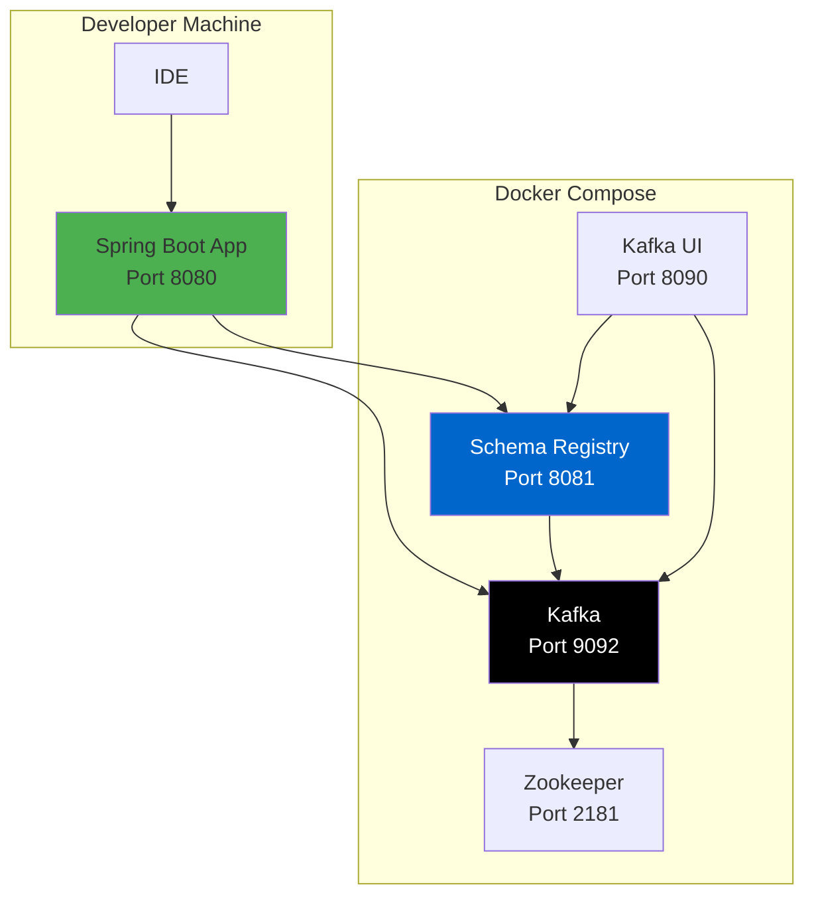

# BioPro Event Governance Framework - Architecture

## Enterprise Architecture Overview

This document provides detailed architecture diagrams and design decisions for the BioPro Event Governance Framework.

---

## Detailed Component Architecture

---

## Event Processing Flow (Detailed)

---

## DLQ Data Model

---

## Resilience Patterns

### Circuit Breaker States

### Retry Strategy

---

## Schema Registry Integration

### Schema Caching Strategy

### Schema Evolution

---

## Deployment Architecture

### Development Environment

### Production Environment (Multi-AZ)

---

## Monitoring & Observability

### Metrics Flow

### Key Dashboard Panels

---

## Security Architecture

### Authentication & Authorization Flow

---

## Design Decisions

### 1. Multi-Module Maven Project

**Decision**: Use Maven multi-module structure instead of separate repositories

**Rationale**:
- Simplified dependency management
- Easier versioning across modules
- Single build command for entire library
- Consistent release process

### 2. Spring Boot Starter Pattern

**Decision**: Package as Spring Boot Starter with auto-configuration

**Rationale**:
- Zero-configuration for consuming applications
- Follows Spring Boot conventions
- Easy adoption by BioPro teams
- Automatic bean registration

### 3. Single-Layer In-Memory Schema Caching

**Decision**: Use only in-memory Caffeine cache (Schema Registry has built-in caching)

**Rationale**:
- Schema Registry client already has built-in caching
- Simpler architecture (no external cache dependency)
- Lower operational overhead
- Caffeine provides excellent performance for application-level caching
- Reduces infrastructure complexity

### 4. Circuit Breaker + Retry

**Decision**: Use both patterns together (circuit breaker wraps retry)

**Rationale**:
- Retry handles transient failures
- Circuit breaker prevents cascading failures
- Combined approach provides comprehensive resilience
- Aligns with enterprise patterns

### 5. DLQ per Module

**Decision**: Each BioPro module has its own DLQ topic

**Rationale**:
- Module isolation
- Independent reprocessing workflows
- Easier troubleshooting
- Module-specific retention policies

---

## Performance Characteristics

### Throughput

- **Event Validation**: 10,000+ events/sec
- **DLQ Routing**: 5,000+ events/sec
- **Schema Cache Hit Rate**: >95% in steady state

### Latency (p99)

- **Event Processing**: < 100ms
- **Schema Validation**: < 10ms (cache hit)
- **Schema Validation**: < 50ms (cache miss)
- **DLQ Routing**: < 50ms

### Resource Usage

- **Memory**: ~512MB baseline + schema cache
- **CPU**: Low (<10% idle, <30% under load)
- **Network**: Dependent on event size and throughput

---

## Future Enhancements

1. **AWS Integration**
   - Secrets Manager for credentials
   - KMS for encryption
   - CloudWatch Logs for audit trail
   - S3 for long-term DLQ storage

2. **Advanced Security**
   - Complete JWT validation with Cognito
   - Fine-grained RBAC with LDAP integration
   - Automated PII detection with AWS Comprehend
   - Field-level encryption

3. **Enhanced Monitoring**
   - Full Dynatrace OneAgent integration
   - Custom business events
   - Executive dashboards
   - Automated alerting

4. **Operational Features**
   - Web UI for DLQ management
   - Bulk reprocessing capabilities
   - Automated recovery workflows
   - Historical analytics

---

## References

- [Confluent Schema Registry Documentation](https://docs.confluent.io/platform/current/schema-registry/index.html)
- [Spring Boot Documentation](https://spring.io/projects/spring-boot)
- [Resilience4j Documentation](https://resilience4j.readme.io/)
- [Apache Kafka Documentation](https://kafka.apache.org/documentation/)

---

**Document Version**: 1.0
**Last Updated**: 2025
**Author**: Melvin Jones, Solutions Architect
