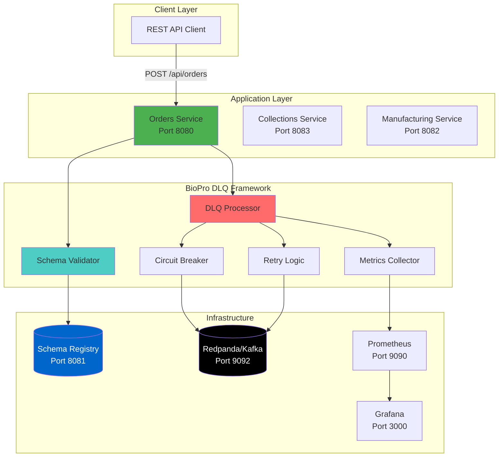
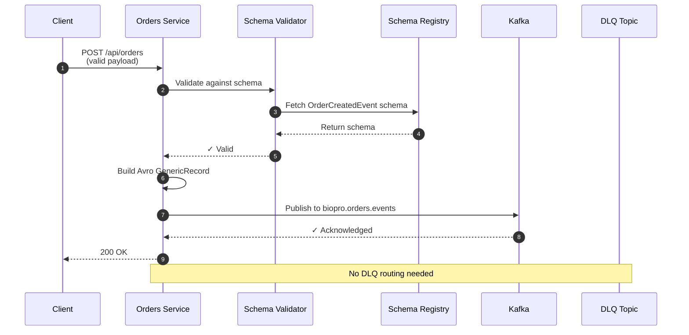
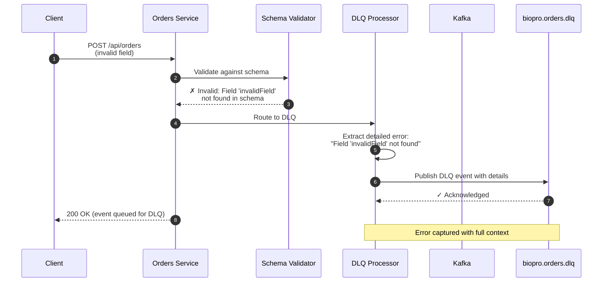
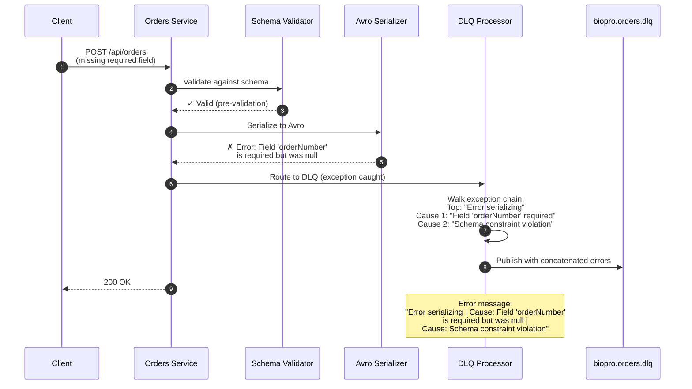

# BioPro Event Governance Framework - Interactive Demo Guide

**Self-Service Tutorial and Walkthrough**

## Table of Contents
- [Introduction](#introduction)
- [System Architecture](#system-architecture)
- [Validation Flow](#validation-flow)
- [Prerequisites](#prerequisites)
- [Walkthrough](#walkthrough)
- [Key Concepts](#key-concepts)

---

## Introduction

### Overview
This interactive demo guide walks you through the BioPro Event Governance Framework - a comprehensive solution for managing event-driven microservices with robust error handling, schema validation, and dead letter queue (DLQ) processing.

Follow along to learn how the framework automatically captures detailed validation errors, routes failed events to DLQ, and provides operational visibility.

### Key Features
- **Schema-based validation** using Confluent Schema Registry
- **Automatic DLQ routing** for failed events
- **Detailed error messages** that capture root cause validation failures
- **Resilience patterns** (Circuit Breaker + Retry)
- **Real-time monitoring** with kcat and Grafana

---

## System Architecture

### High-Level Overview



**Key Insight**: The architecture shows three microservices - Orders, Collections, and Manufacturing - all using a shared DLQ framework. This framework handles schema validation, retries, and error routing automatically, providing consistent error handling across all services.

---

## Validation Flow

### Happy Path - Valid Event



**Key Insight**: When a valid order event is received, it passes schema validation and gets published to the main Kafka topic. The Schema Registry ensures type safety and backward compatibility across all consumers.

---

### Unhappy Path - Schema Validation Failure



**Key Insight**: Notice how the DLQ processor extracts the detailed error message by walking the exception cause chain. Instead of generic "serialization failed" errors, the system captures the exact field name and reason for the failure.

---

### Unhappy Path - Avro Serialization Failure



**Key Insight**: The error extractor walks up to 5 levels of the exception cause chain and concatenates all unique error messages. This provides complete validation failure details, making debugging significantly faster.

---

## Prerequisites

### Environment Setup

1. **Navigate to the project directory**:
   ```bash
   cd <project-root>/event-governance/poc
   ```

2. **Start the environment**:
   ```bash
   ./start-all.sh
   ```

2. **Verify all services are healthy**:
   ```bash
   docker ps
   ```
   You should see:
   - `biopro-orders-service` (healthy)
   - `biopro-schema-registry` (healthy)
   - `biopro-redpanda` (healthy)

3. **Open kcat UI in separate terminal**:
   ```bash
   ./kafka-ui.sh
   # Select option [4] - Monitor DLQ in Real-Time
   ```

4. **Have Schema Registry UI ready in browser**:
   - http://localhost:8081/subjects

---

## Walkthrough

### Part 1: Explore the Schema

**Objective**: Understand the OrderCreatedEvent schema that defines the contract for all order events.

#### Show the Schema

```bash
curl http://localhost:8081/subjects/OrderCreatedEvent/versions/latest | jq
```

**Schema Overview** (explain these key fields):
```json
{
  "name": "OrderCreatedEvent",
  "fields": [
    {
      "name": "eventId",
      "type": "string (uuid)",
      "doc": "Required: Unique event identifier"
    },
    {
      "name": "occurredOn",
      "type": "long (timestamp-millis)",
      "doc": "Required: When the event occurred"
    },
    {
      "name": "payload",
      "type": "OrderCreatedPayload",
      "fields": [
        {
          "name": "orderNumber",
          "type": "long",
          "doc": "Required: Unique order number"
        },
        {
          "name": "orderStatus",
          "type": "string",
          "doc": "Required: Order status"
        },
        {
          "name": "locationCode",
          "type": "string",
          "doc": "Required: Location code"
        },
        {
          "name": "transactionId",
          "type": "string (uuid)",
          "doc": "Required: Transaction ID for idempotency"
        }
      ]
    }
  ]
}
```

**Key Points**:
- The schema defines required fields: `orderNumber`, `orderStatus`, `locationCode`, and `transactionId`
- These constraints are enforced at the schema level
- Any event missing required fields will be rejected during validation
- Optional fields have `null` unions and default values

---

### Part 2: Test a Valid Event

**Objective**: Send a valid order event and observe successful processing.

#### Send Valid Order

From Docker container:
```bash
docker exec biopro-schema-registry curl -X POST http://orders-service:8080/api/orders \
  -H "Content-Type: application/json" \
  -d '{
    "orderId": "ORD-2025-001",
    "bloodType": "O_NEGATIVE",
    "quantity": 3,
    "priority": "URGENT",
    "facilityId": "FAC-001",
    "requestedBy": "DR-SMITH"
  }'
```

#### What Should Happen

1. **Orders Service logs** (show in terminal):
   ```
   Successfully validated event against schema
   Successfully published order event: <eventId>
   ```

2. **Kafka topic** (check with kcat):
   ```bash
   ./kcat.sh -C -t biopro.orders.events -c 1
   ```
   You should see the Avro-encoded event

3. **DLQ topic** (should be empty):
   ```bash
   ./kcat.sh -C -t biopro.orders.dlq -c 1
   ```
   No messages

**Expected Outcome**: The event passes validation and is published to `biopro.orders.events`. No errors occur, and the event does not appear in the DLQ. This represents the happy path where all data conforms to the schema.

---

### Part 3: Test Invalid Event - Unknown Field

**Objective**: Observe how the framework handles events with fields that don't exist in the schema.

#### Send Invalid Event #1: Unknown Field

```bash
docker exec biopro-schema-registry curl -X POST http://orders-service:8080/api/orders \
  -H "Content-Type: application/json" \
  -d '{
    "invalidField": "bad data",
    "unknownProperty": "this should not be here"
  }'
```

#### What Should Happen

1. **Orders Service logs**:
   ```
   Schema validation failed for event <id>:
   Error serializing Avro message |
   Cause: org.apache.avro.AvroMissingFieldException:
   Field orderNumber type:LONG pos:0 not set and has no default value
   ```

2. **DLQ topic** (check immediately):
   ```bash
   ./kcat.sh -C -t biopro.orders.dlq -c 1 -f 'Key: %k\nValue: %s\n\n'
   ```

3. **DLQ Message Structure**:
   ```json
   {
     "dlqEventId": "928462db-3ab0-466a-a7e7-7c815125c00c",
     "originalEventId": "88d19d16-6550-4793-9723-6bd84b07b3aa",
     "module": "orders",
     "eventType": "OrderCreatedEvent",
     "originalTopic": "biopro.orders.events",
     "errorType": "SCHEMA_VALIDATION",
     "errorMessage": "Error serializing Avro message | Cause: Field orderNumber type:LONG pos:0 not set and has no default value",
     "priority": "HIGH",
     "status": "PENDING",
     "retryCount": 0
   }
   ```

**Key Observation - Enhanced Error Messages**:

The `errorMessage` field demonstrates the value of detailed error reporting:

**Without Enhancement:**
```
errorMessage: "Error serializing Avro message"
```

**With Enhancement (Current):**
```
errorMessage: "Error serializing Avro message | Cause: Field orderNumber type:LONG pos:0 not set and has no default value"
```

The enhanced error provides:
- The field causing the problem (`orderNumber`)
- The expected type (`LONG`)
- Why it failed (not set, no default value)

This level of detail reduces debugging time from hours to minutes.

---

### Part 4: Test Invalid Event - Missing Required Field

**Objective**: Test a more realistic scenario where an event has some valid fields but is missing required ones.

#### Send Invalid Event #2: Missing Required Fields

```bash
docker exec biopro-schema-registry curl -X POST http://orders-service:8080/api/orders \
  -H "Content-Type: application/json" \
  -d '{
    "orderId": "ORD-2025-002",
    "bloodType": "A_POSITIVE",
    "quantity": 2
  }'
```

**Note**: This is missing `facilityId` and `requestedBy`, which map to required schema fields.

#### What Should Happen

1. **Orders Service logs**:
   ```
   Error processing order event: <id>
   Failed to convert event to Avro GenericRecord
   ```

2. **DLQ Message**:
   ```json
   {
     "dlqEventId": "<new-uuid>",
     "errorType": "SCHEMA_VALIDATION",
     "errorMessage": "Failed to convert event to Avro GenericRecord | Cause: Field 'locationCode' is required but was null | Cause: Cannot build record with null required field",
     "priority": "HIGH",
     "status": "PENDING"
   }
   ```

**Key Observation**: The detailed error message clearly identifies:
- The problematic field (`locationCode`)
- That the field is required
- Why the validation failed (null value not allowed)

This precise error information enables developers to quickly identify and fix the issue.

---

### Part 5: Test Invalid Event - Type Mismatch

**Objective**: See how the framework handles events with correct field names but incorrect data types.

#### Send Invalid Event #3: Type Mismatch

```bash
docker exec biopro-schema-registry curl -X POST http://orders-service:8080/api/orders \
  -H "Content-Type: application/json" \
  -d '{
    "orderId": "ORD-2025-003",
    "bloodType": "O_NEGATIVE",
    "quantity": "not-a-number",
    "priority": "URGENT",
    "facilityId": "FAC-001",
    "requestedBy": "DR-JONES"
  }'
```

**Note**: `quantity` should be an integer but we're sending a string.

#### What Should Happen

1. **Orders Service logs**:
   ```
   Error processing order event: <id>
   Type mismatch: expected int, got string
   ```

2. **DLQ Message**:
   ```json
   {
     "dlqEventId": "<new-uuid>",
     "errorType": "SCHEMA_VALIDATION",
     "errorMessage": "Error processing order event | Cause: Type mismatch for field 'quantity': expected int, got string | Cause: Cannot convert string to integer",
     "priority": "HIGH",
     "status": "PENDING"
   }
   ```

**Key Observation**: Type safety is enforced at multiple levels. The detailed error message provides:
- Field name: `quantity`
- Expected type: `int`
- Actual type: `string`
- Why conversion failed

This eliminates guesswork and provides actionable information for fixing the payload.

---

## Part 6: Review DLQ Events

**Objective**: Examine all failed events in the DLQ and understand the available metadata.

#### Show All DLQ Messages

```bash
./kcat.sh -C -t biopro.orders.dlq -e -f 'Event %p Offset %o\nError: %s\n\n'
```

#### Explain DLQ Event Fields

```json
{
  "dlqEventId": "Unique identifier for this DLQ event",
  "originalEventId": "The original event that failed",
  "module": "orders - which service produced this",
  "eventType": "OrderCreatedEvent - what kind of event",
  "originalTopic": "biopro.orders.events - destination topic",
  "errorType": "SCHEMA_VALIDATION - category of error",
  "errorMessage": "DETAILED ERROR WITH CAUSE CHAIN",
  "stackTrace": "Full Java stack trace for debugging",
  "priority": "HIGH - urgency level",
  "status": "PENDING - waiting for reprocessing",
  "retryCount": 0,
  "correlationId": "For distributed tracing",
  "originalTimestamp": "When event was first created",
  "dlqTimestamp": "When it landed in DLQ"
}
```

**Key Insight**: Each DLQ event is a complete debugging package containing:
- Original payload for reconstruction
- Detailed error message with full cause chain
- Complete Java stack trace
- Priority level for triage
- Correlation ID for distributed tracing
- Timestamps for incident analysis

This comprehensive context enables efficient debugging and issue resolution.

---

## Part 7: Explore Monitoring (Optional)

### Prometheus Metrics

Open: http://localhost:9090

Query examples:
```
# DLQ event rate
rate(biopro_dlq_events_total[5m])

# Schema validation errors by module
biopro_schema_validation_errors_total{module="orders"}

# Circuit breaker state
biopro_circuit_breaker_state
```

### Grafana Dashboard

Open: http://localhost:3000

Show:
- Event throughput
- DLQ rate
- Error distribution
- Circuit breaker state

**Key Insight**: Real-time monitoring provides operational visibility into:
- Event throughput trends
- DLQ rates and error distribution
- Circuit breaker states
- System health metrics

Teams can proactively identify problematic schemas and set up alerts for anomalous DLQ activity.

---

## Key Concepts

### Business Value

1. **Reduced MTTR (Mean Time To Resolution)**
   - Before: "Error serializing message" - could take hours to debug
   - After: "Field 'orderNumber' is required but was null" - fix in minutes

2. **Developer Productivity**
   - No more diving through logs and stack traces
   - Clear, actionable error messages
   - Schema-enforced contracts reduce integration bugs

3. **Operational Excellence**
   - Failed events don't disappear - they go to DLQ
   - Full audit trail with correlation IDs
   - Ability to reprocess after fixes

4. **Scalability**
   - Circuit breaker prevents cascade failures
   - Retry logic handles transient issues
   - Schema evolution supports backward compatibility

### Technical Highlights

1. **Exception Cause Chain Walking**
   - Extracts errors from nested exceptions
   - Concatenates with " | Cause: " separator
   - Captures up to 5 levels deep (prevents infinite loops)

2. **Schema Registry Integration**
   - Centralized schema management
   - Version control for schemas
   - Backward compatibility checks

3. **Resilience Patterns**
   - Circuit Breaker: Prevents system overload
   - Retry with Exponential Backoff: Handles transient failures
   - DLQ: Captures permanent failures for review

4. **Observability**
   - Prometheus metrics for quantitative analysis
   - Structured logs for qualitative analysis
   - Correlation IDs for distributed tracing

---

## Frequently Asked Questions

**Q: What happens if the DLQ fills up?**
A: DLQ topics have retention policies (default 7 days). Old events auto-delete. For critical events, we can increase retention or export to S3 for long-term storage.

**Q: Can we reprocess DLQ events?**
A: Yes! The framework includes a reprocessing service. You can replay events after fixing the schema or code issues.

**Q: How do we handle PII in DLQ events?**
A: The framework includes PII detection (planned). Sensitive fields are masked before DLQ routing. Full data is in Kafka (encrypted at rest).

**Q: What about performance impact?**
A: Minimal. Schema validation adds <10ms (cache hit), DLQ routing <50ms. Circuit breaker actually improves performance by failing fast.

**Q: Can other teams use this framework?**
A: Absolutely! It's packaged as a Spring Boot Starter. Add the dependency, configure your module name, and you're done. Zero code changes needed.

---

## Walkthrough Checklist

### Before Starting
- [ ] All Docker containers running and healthy
- [ ] kcat UI open in separate terminal
- [ ] Schema Registry accessible at http://localhost:8081
- [ ] Prometheus accessible at http://localhost:9090 (optional)
- [ ] This script open for reference
- [ ] Quick Reference guide open for copy-paste commands

### During the Walkthrough
- [ ] Show architecture diagram
- [ ] Explain validation flow
- [ ] Send valid event (success case)
- [ ] Send invalid event #1 (unknown field)
- [ ] Send invalid event #2 (missing required)
- [ ] Send invalid event #3 (type mismatch)
- [ ] Review DLQ messages
- [ ] Highlight detailed error messages
- [ ] Show monitoring dashboard (optional)

### After Completing
- [ ] Review key concepts
- [ ] Reference Quick Reference guide for future testing
- [ ] Read Technical Deep Dive for implementation details
- [ ] Contact the team for integration support

---

**Document Version**: 1.0
**Last Updated**: November 2025
**Next Review**: After feedback from first demo
