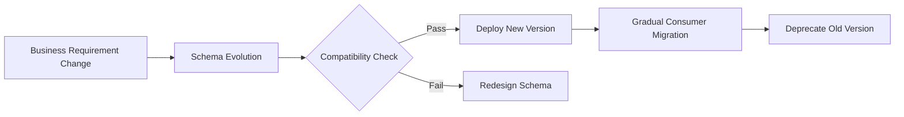
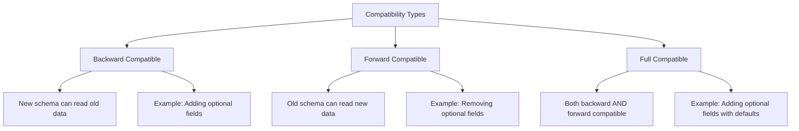
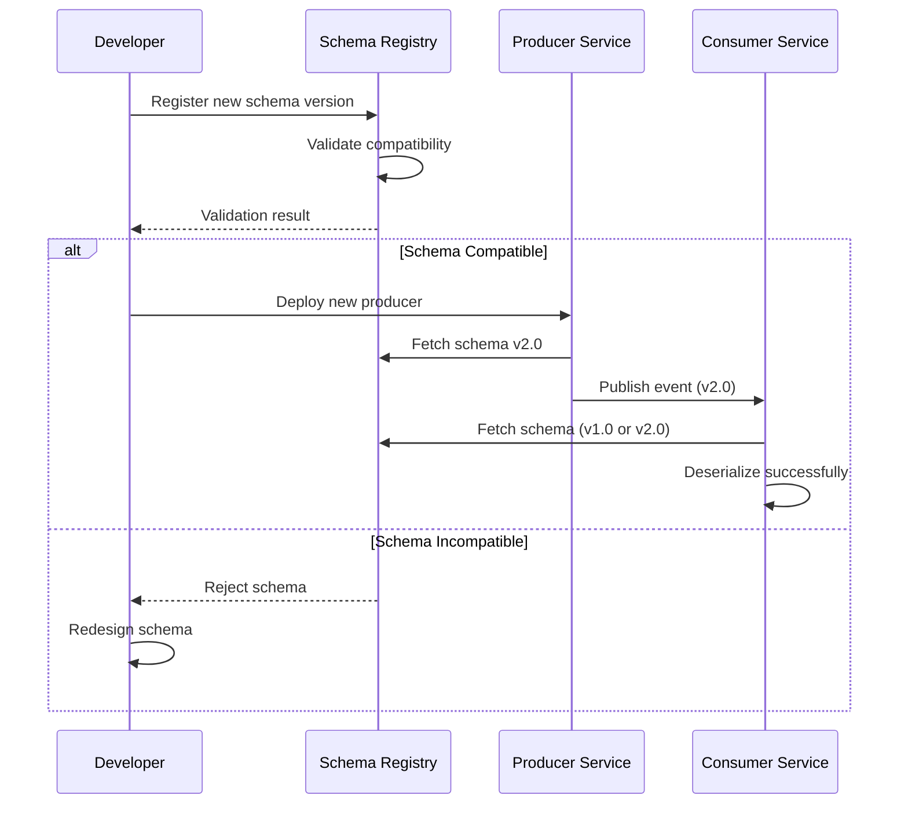
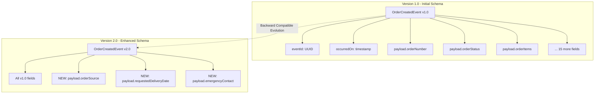
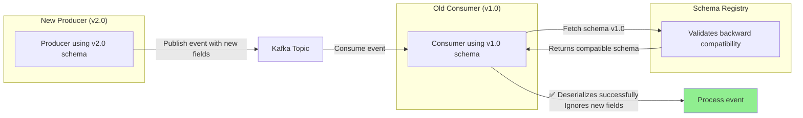
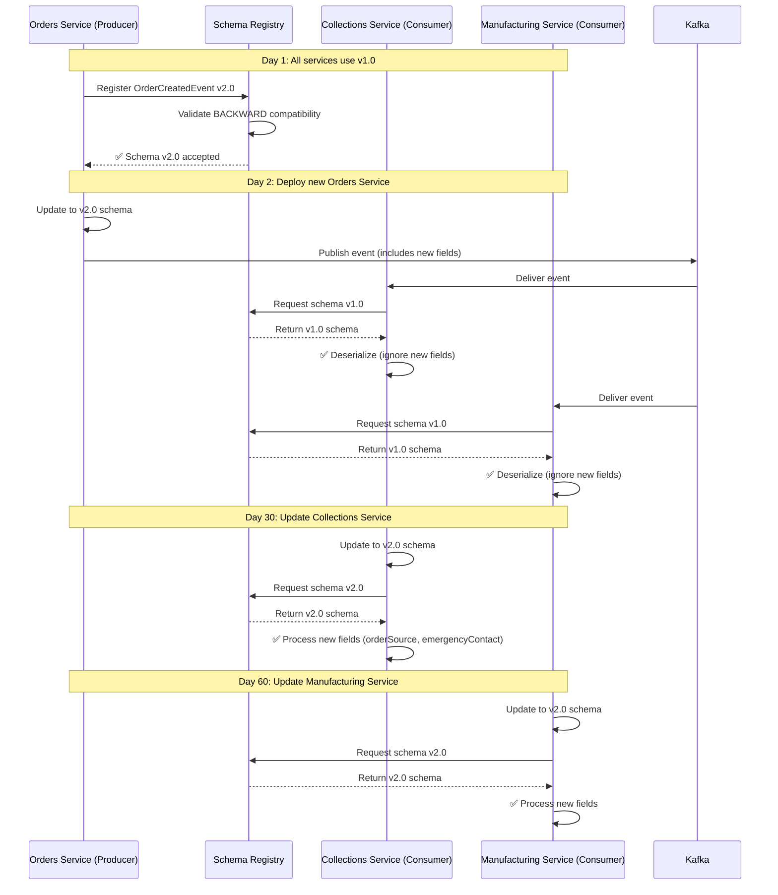
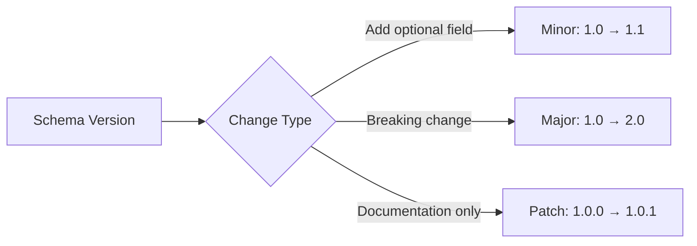
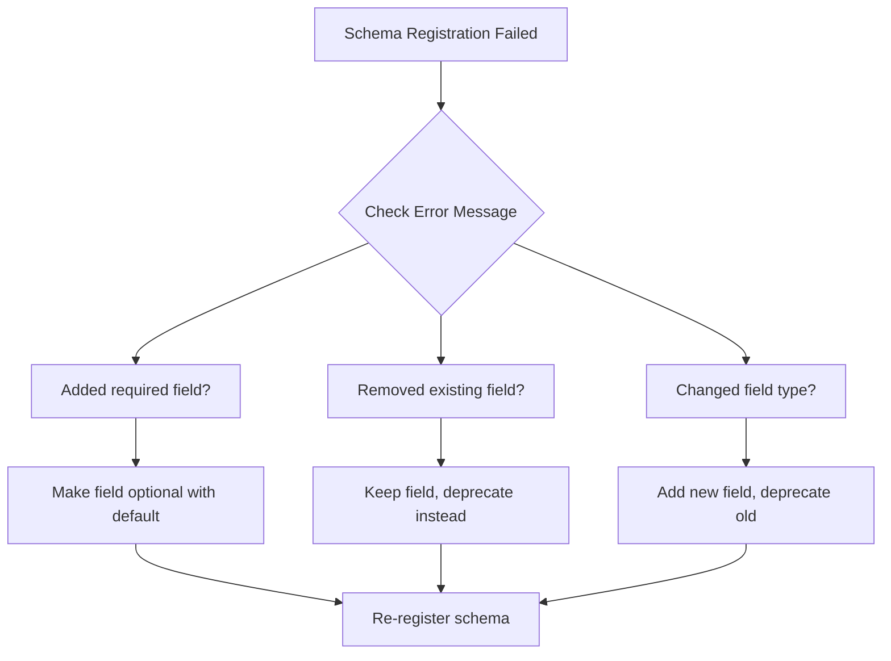
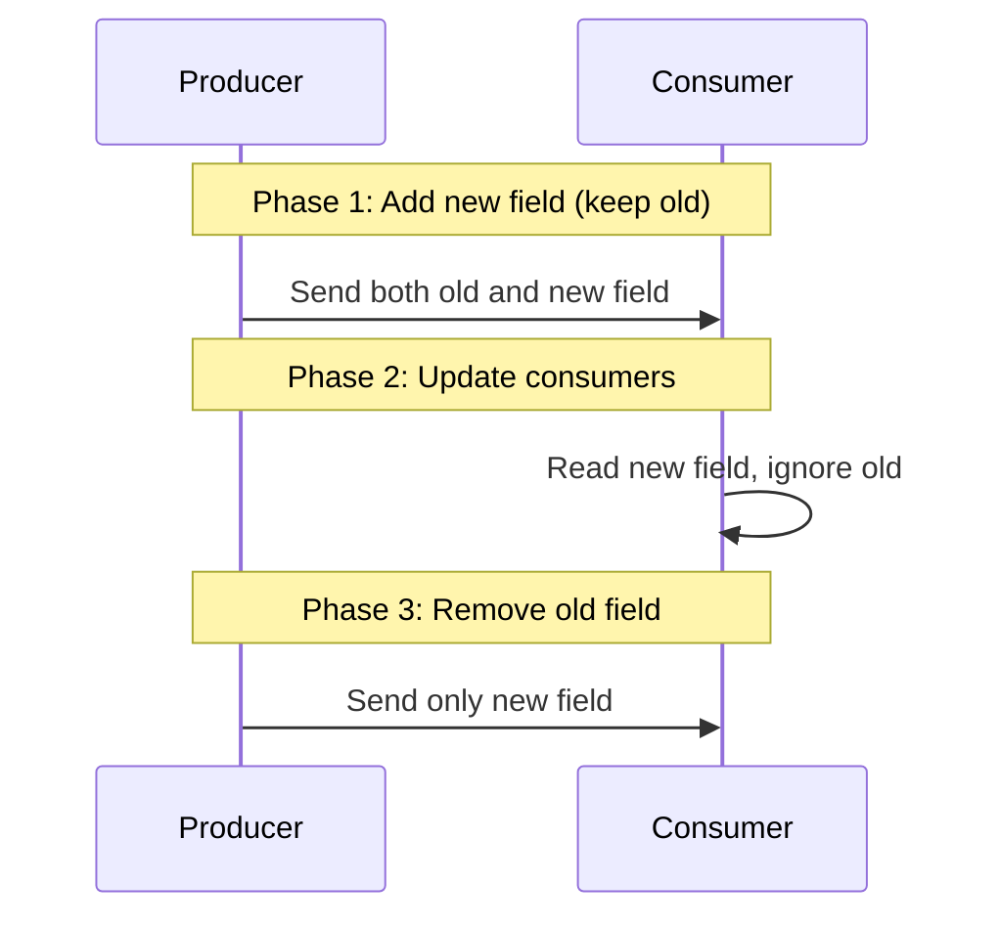

# Schema Evolution Guide: Best Practices and Implementation

## Table of Contents
- [What is Schema Evolution?](#what-is-schema-evolution)
- [Why Schema Evolution Matters](#why-schema-evolution-matters)
- [Compatibility Types](#compatibility-types)
- [Schema Evolution Strategy](#schema-evolution-strategy)
- [Real-World Example: OrderCreatedEvent](#real-world-example-ordercreatedevent)
- [Best Practices](#best-practices)
- [Troubleshooting](#troubleshooting)

---

## What is Schema Evolution?

Schema evolution is the process of modifying event schemas over time while maintaining compatibility with existing producers and consumers. In event-driven architectures, schemas define the contract between services - when business requirements change, schemas must evolve without breaking existing integrations.



---

## Why Schema Evolution Matters

Without proper schema evolution:
- **Service Outages**: Incompatible schema changes break consumers
- **Data Loss**: Missing fields can cause data to be dropped
- **Deployment Coupling**: All services must deploy simultaneously
- **Integration Fragility**: Third-party integrations break unexpectedly

With proper schema evolution:
- **Zero-Downtime Deployments**: Services can deploy independently
- **Backward Compatibility**: Old consumers continue to work
- **Forward Compatibility**: New producers don't break old consumers
- **Flexible Migration**: Gradual rollout of new features

---

## Compatibility Types



### Backward Compatibility
**Definition**: New consumers can process messages written with old schema

**Safe Operations**:
- ✅ Add optional fields with defaults
- ✅ Remove required fields (becomes optional)
- ✅ Add new enum values (with default handling)

**Unsafe Operations**:
- ❌ Remove optional fields
- ❌ Add required fields without defaults
- ❌ Change field types
- ❌ Rename fields

### Forward Compatibility
**Definition**: Old consumers can process messages written with new schema

**Safe Operations**:
- ✅ Add optional fields (old consumers ignore them)
- ✅ Remove optional fields

**Unsafe Operations**:
- ❌ Add required fields
- ❌ Remove required fields
- ❌ Change field types

### Full Compatibility
**Definition**: Both backward AND forward compatible

**Safe Operations**:
- ✅ Add optional fields with defaults only
- ✅ Change field documentation

---

## Schema Evolution Strategy



### Our Configuration

In our BioPro event-driven architecture, we enforce **BACKWARD** compatibility:

```yaml
# Schema Registry Configuration
SCHEMA_REGISTRY_KAFKASTORE_BOOTSTRAP_SERVERS: redpanda:9092
SCHEMA_REGISTRY_COMPATIBILITY_MODE: BACKWARD
```

This means:
- New consumers MUST be able to read old messages
- We can safely add optional fields
- We can safely evolve schemas without breaking existing consumers

---

## Real-World Example: OrderCreatedEvent

### Business Context

The BioPro Orders team received a requirement to track:
1. **Order Source**: Where the order originated (WEB, MOBILE, API, INTERNAL)
2. **Requested Delivery Date**: When customer wants delivery
3. **Emergency Contact**: Contact info for urgent/life-threatening orders

### Schema Evolution Journey



### Version 1.0 Schema (Simplified)

```json
{
  "type": "record",
  "name": "OrderCreatedEvent",
  "namespace": "com.biopro.events.orders",
  "version": "1.0",
  "fields": [
    {
      "name": "eventId",
      "type": "string",
      "logicalType": "uuid"
    },
    {
      "name": "payload",
      "type": {
        "type": "record",
        "name": "OrderCreatedPayload",
        "fields": [
          {"name": "orderNumber", "type": "long"},
          {"name": "orderStatus", "type": "string"},
          {"name": "locationCode", "type": "string"},
          {"name": "createDate", "type": "long", "logicalType": "timestamp-millis"},
          {"name": "orderItems", "type": {"type": "array", "items": "OrderItemCreated"}}
        ]
      }
    }
  ]
}
```

### Version 2.0 Schema (New Fields Added)

```json
{
  "type": "record",
  "name": "OrderCreatedEvent",
  "namespace": "com.biopro.events.orders",
  "version": "2.0",
  "fields": [
    {
      "name": "eventId",
      "type": "string",
      "logicalType": "uuid"
    },
    {
      "name": "payload",
      "type": {
        "type": "record",
        "name": "OrderCreatedPayload",
        "fields": [
          {"name": "orderNumber", "type": "long"},
          {"name": "orderStatus", "type": "string"},

          // NEW FIELD 1: Order Source
          {
            "name": "orderSource",
            "type": ["null", "string"],
            "doc": "Source system that created the order (WEB, MOBILE, API, INTERNAL)",
            "default": null
          },

          // NEW FIELD 2: Requested Delivery Date
          {
            "name": "requestedDeliveryDate",
            "type": ["null", {"type": "long", "logicalType": "timestamp-millis"}],
            "doc": "When customer requested delivery",
            "default": null
          },

          // NEW FIELD 3: Emergency Contact (Nested Record)
          {
            "name": "emergencyContact",
            "type": [
              "null",
              {
                "type": "record",
                "name": "EmergencyContact",
                "fields": [
                  {"name": "name", "type": "string"},
                  {"name": "phone", "type": "string"},
                  {"name": "relationship", "type": ["null", "string"], "default": null}
                ]
              }
            ],
            "default": null
          }
        ]
      }
    }
  ]
}
```

### Compatibility Analysis



**Why This Works**:
1. **All new fields are optional** (`["null", "type"]` union with `"default": null`)
2. **No existing fields were removed or changed**
3. **Backward compatibility maintained** - old consumers ignore new fields
4. **Schema Registry validates** compatibility before accepting v2.0

### Service Migration Flow



### Code Example: Producer Evolution

**Before (v1.0) - Orders Service**:
```java
OrderCreatedEvent event = OrderCreatedEvent.newBuilder()
    .setEventId(UUID.randomUUID().toString())
    .setOccurredOn(Instant.now().toEpochMilli())
    .setEventType("OrderCreated")
    .setEventVersion("1.0")
    .setPayload(OrderCreatedPayload.newBuilder()
        .setOrderNumber(order.getOrderNumber())
        .setOrderStatus(order.getStatus().name())
        .setLocationCode(order.getLocationCode())
        .setCreateDate(order.getCreateDate().toEpochMilli())
        .setOrderItems(mapOrderItems(order.getItems()))
        .build())
    .build();

kafkaTemplate.send("biopro.orders.events", event);
```

**After (v2.0) - Orders Service**:
```java
OrderCreatedEvent event = OrderCreatedEvent.newBuilder()
    .setEventId(UUID.randomUUID().toString())
    .setOccurredOn(Instant.now().toEpochMilli())
    .setEventType("OrderCreated")
    .setEventVersion("2.0")  // Updated version
    .setPayload(OrderCreatedPayload.newBuilder()
        .setOrderNumber(order.getOrderNumber())
        .setOrderStatus(order.getStatus().name())
        .setLocationCode(order.getLocationCode())
        .setCreateDate(order.getCreateDate().toEpochMilli())
        .setOrderItems(mapOrderItems(order.getItems()))

        // NEW FIELDS - All optional with null defaults
        .setOrderSource(order.getSource())  // "WEB", "MOBILE", etc.
        .setRequestedDeliveryDate(order.getRequestedDeliveryDate() != null
            ? order.getRequestedDeliveryDate().toEpochMilli()
            : null)
        .setEmergencyContact(order.getEmergencyContact() != null
            ? EmergencyContact.newBuilder()
                .setName(order.getEmergencyContact().getName())
                .setPhone(order.getEmergencyContact().getPhone())
                .setRelationship(order.getEmergencyContact().getRelationship())
                .build()
            : null)
        .build())
    .build();

kafkaTemplate.send("biopro.orders.events", event);
```

### Code Example: Consumer Migration

**Before (v1.0) - Collections Service**:
```java
@KafkaListener(topics = "biopro.orders.events")
public void handleOrderCreated(OrderCreatedEvent event) {
    log.info("Received order: {}", event.getPayload().getOrderNumber());

    // Process basic order info
    collectionService.planCollection(
        event.getPayload().getOrderNumber(),
        event.getPayload().getLocationCode(),
        event.getPayload().getOrderItems()
    );
}
```

**After (v2.0) - Collections Service** (Gradual Migration):
```java
@KafkaListener(topics = "biopro.orders.events")
public void handleOrderCreated(OrderCreatedEvent event) {
    OrderCreatedPayload payload = event.getPayload();

    log.info("Received order: {} from source: {}",
        payload.getOrderNumber(),
        payload.getOrderSource() != null ? payload.getOrderSource() : "UNKNOWN");

    // Process basic order info (works with v1.0 and v2.0)
    CollectionPlan plan = collectionService.planCollection(
        payload.getOrderNumber(),
        payload.getLocationCode(),
        payload.getOrderItems()
    );

    // NEW: Handle requested delivery date if present
    if (payload.getRequestedDeliveryDate() != null) {
        plan.setTargetDate(Instant.ofEpochMilli(payload.getRequestedDeliveryDate()));
    }

    // NEW: Prioritize if emergency contact provided
    if (payload.getEmergencyContact() != null) {
        plan.setPriority(Priority.URGENT);
        plan.setEmergencyContact(payload.getEmergencyContact().getPhone());
    }

    plan.save();
}
```

---

## Best Practices

### 1. Always Use Optional Fields for New Additions

```json
// ✅ GOOD - Optional with default
{
  "name": "orderSource",
  "type": ["null", "string"],
  "default": null
}

// ❌ BAD - Required field breaks backward compatibility
{
  "name": "orderSource",
  "type": "string"
}
```

### 2. Version Your Schemas Semantically



- **Major (2.0)**: Breaking changes (avoid if possible)
- **Minor (1.1)**: Backward-compatible additions
- **Patch (1.0.1)**: Documentation or metadata changes

### 3. Include Schema Version in Events

```json
{
  "eventVersion": "2.0",
  "eventType": "OrderCreated"
}
```

This helps with:
- Debugging production issues
- Monitoring adoption rates
- Troubleshooting compatibility problems

### 4. Test Schema Evolution

```python
# Example schema evolution test
def test_backward_compatibility():
    # Old consumer with v1.0 schema
    old_consumer = Consumer(schema_version="1.0")

    # New producer with v2.0 schema
    new_event = create_order_event_v2(
        order_number=12345,
        order_source="WEB",  # New field
        emergency_contact={"name": "John", "phone": "555-1234"}  # New field
    )

    # Old consumer should deserialize without error
    result = old_consumer.deserialize(new_event)
    assert result.order_number == 12345
    # New fields are ignored, no error raised
```

### 5. Document Schema Changes

Maintain a changelog in your schema documentation:

```markdown
## OrderCreatedEvent Changelog

### Version 2.0 (2024-11-15)
**Added**:
- `payload.orderSource` - Track order origin system
- `payload.requestedDeliveryDate` - Customer delivery preference
- `payload.emergencyContact` - Contact for urgent orders

**Compatibility**: BACKWARD compatible with v1.0

### Version 1.0 (2024-01-15)
**Initial Release**:
- Basic order creation event
- Order items array
- Customer and location information
```

### 6. Monitor Schema Registry

```bash
# Check schema versions
curl http://localhost:8081/subjects/biopro.orders.events-value/versions

# Verify compatibility mode
curl http://localhost:8081/config

# Test schema compatibility before registering
curl -X POST http://localhost:8081/compatibility/subjects/biopro.orders.events-value/versions/latest \
  -H "Content-Type: application/vnd.schemaregistry.v1+json" \
  -d @new-schema.json
```

### 7. Use Schema Registry UI

Access the Schema Registry UI at http://localhost:8000 to:
- Browse schema versions
- View schema diffs between versions
- Verify compatibility settings
- Track schema evolution history

---

## Troubleshooting

### Error: "Schema being registered is incompatible"



**Solution**:
1. Make new fields optional with defaults
2. Don't remove or rename existing fields
3. Use schema versioning instead of breaking changes

### Error: "Consumer cannot deserialize message"

**Symptoms**:
- Consumer crashes with deserialization error
- Missing field exceptions
- Type mismatch errors

**Solution**:
```java
// Ensure consumer fetches correct schema from registry
@Value("${spring.kafka.schema-registry-url}")
private String schemaRegistryUrl;

// Let Schema Registry handle compatibility
// Don't hardcode schema versions in consumers
```

### Warning: "Using deprecated field"

**Migration Strategy**:


1. **Phase 1**: Add new field, populate both old and new
2. **Phase 2**: Update all consumers to use new field
3. **Phase 3**: Remove old field in next major version

---

## Summary

Schema evolution is critical for maintaining a healthy event-driven architecture. By following these principles:

✅ **Always use backward compatibility**
✅ **Add optional fields with defaults**
✅ **Test compatibility before deploying**
✅ **Version schemas semantically**
✅ **Document all changes**
✅ **Monitor Schema Registry**

You can evolve your event schemas safely without breaking existing integrations or requiring coordinated deployments across all services.

The OrderCreatedEvent evolution from v1.0 to v2.0 demonstrates how to add significant new functionality (order source tracking, delivery scheduling, emergency contacts) while maintaining full backward compatibility with existing consumers.

---

## Additional Resources

- **Schema Registry UI**: http://localhost:8000
- **Redpanda Console**: http://localhost:8090
- **Confluent Schema Registry Docs**: https://docs.confluent.io/platform/current/schema-registry/
- **Avro Specification**: https://avro.apache.org/docs/current/spec.html
- **EventCatalog** (Schema Documentation): `event-catalog/events/`

---

**Last Updated**: 2024-11-15
**Author**: BioPro Platform Team
**Version**: 1.0
