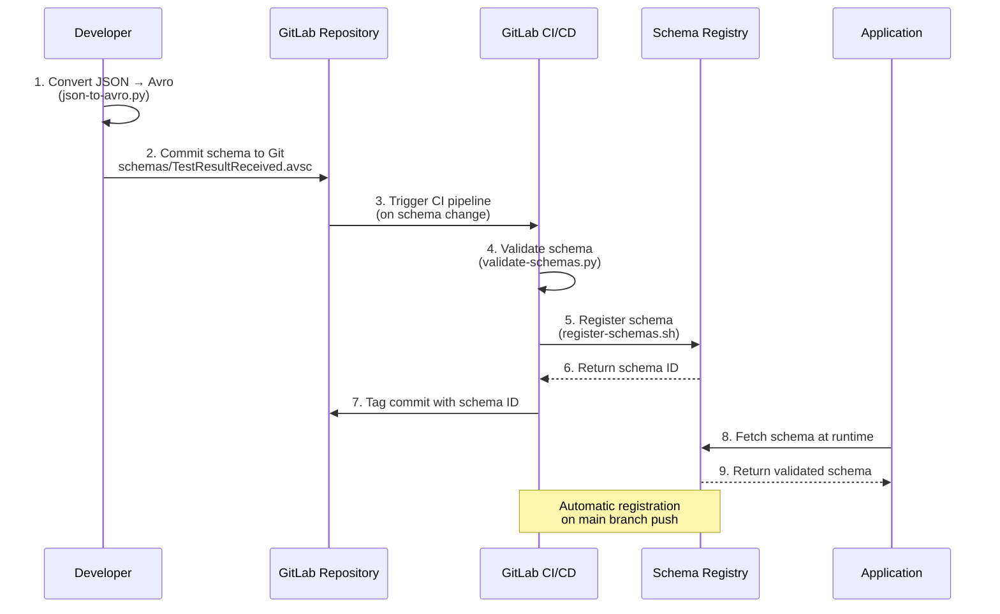
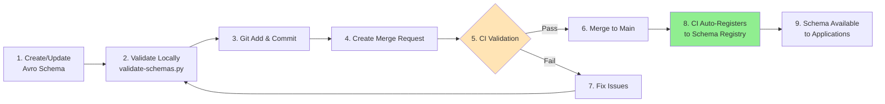
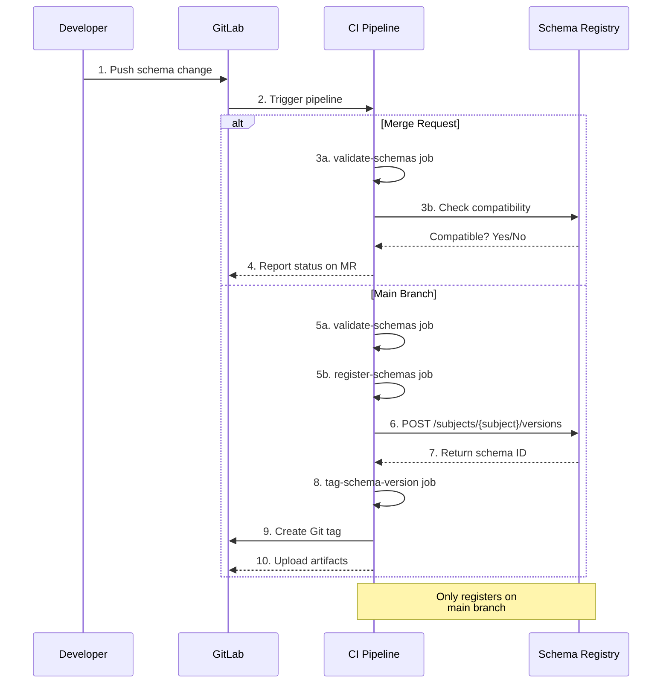
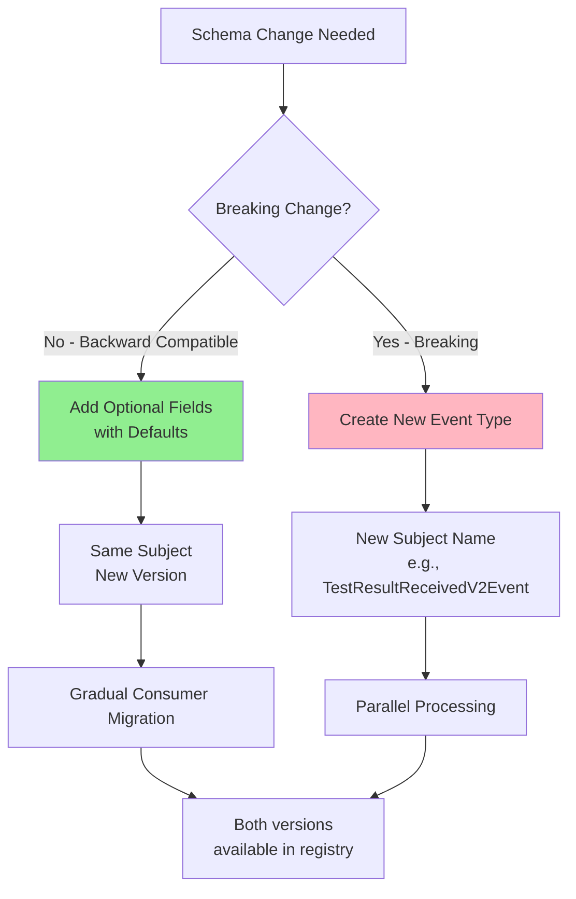

# Schema Management and CI/CD Integration Guide

## Complete Guide: Managing Avro Schemas with Git and Auto-Registration

**Audience**: Developers managing event schemas in the Event Governance Framework
**Prerequisites**: Basic Git knowledge, JSON Schema familiarity
**Time**: 30-60 minutes initial setup

---

## Table of Contents
- [Overview](#overview)
- [Schema Repository Setup](#schema-repository-setup)
- [Converting JSON Schema to Avro](#converting-json-schema-to-avro)
- [Git Workflow](#git-workflow)
- [CI/CD Auto-Registration](#cicd-auto-registration)
- [Schema Evolution in Git](#schema-evolution-in-git)
- [Troubleshooting](#troubleshooting)

---

## Overview

### What This Guide Covers

This guide explains how to:
1. **Convert existing JSON Schemas to Avro format**
2. **Organize schemas in Git repository**
3. **Set up CI/CD pipeline for automatic Schema Registry registration**
4. **Manage schema evolution with version control**

### Architecture: Schema Management Flow



---

## Schema Repository Setup

### Step 1: Create Schema Directory Structure

```bash
# In your service repository
cd testresultmanagement/
mkdir -p schemas/testresults
mkdir -p scripts
```

**Recommended directory structure:**

```
testresultmanagement/
├── src/
│   └── main/
│       ├── java/
│       └── resources/
├── schemas/                           ← All Avro schemas here
│   ├── testresults/                   ← Organized by domain
│   │   ├── TestResultReceived.avsc
│   │   ├── TestResultProcessed.avsc
│   │   └── TestResultException.avsc
│   ├── units/
│   │   ├── UnitUnsuitable.avsc
│   │   └── UnitQuarantined.avsc
│   └── README.md                      ← Schema documentation
├── scripts/                           ← Automation scripts
│   ├── json-to-avro.py
│   ├── validate-schemas.py
│   ├── register-schemas.sh
│   └── README.md
├── .gitlab-ci.yml                     ← CI/CD pipeline
└── pom.xml
```

### Step 2: Download Utility Scripts

Copy the schema management utilities to your repository:

```bash
# Download from internal repository or copy files
cp /path/to/schema-tools/* scripts/

# Make scripts executable
chmod +x scripts/*.sh
chmod +x scripts/*.py
```

**Required files:**
- `json-to-avro.py` - Convert JSON Schema to Avro
- `validate-schemas.py` - Validate Avro schemas
- `register-schemas.sh` - Register schemas to Schema Registry
- `.gitlab-ci.yml.example` - CI/CD pipeline template

---

## Converting JSON Schema to Avro

### Example: TestResultReceived Event

#### Your Existing JSON Schema

**File**: `TestResultReceived.json`

```json
{
  "$schema": "http://json-schema.org/draft-07/schema#",
  "$id": "https://biopro.com/schemas/testresults/TestResultReceived",
  "title": "TestResultReceivedEvent",
  "description": "Event published when a test result is received from laboratory",
  "type": "object",
  "properties": {
    "eventId": {
      "type": "string",
      "format": "uuid",
      "description": "Unique event identifier"
    },
    "occurredOn": {
      "type": "string",
      "format": "date-time",
      "description": "When the event occurred"
    },
    "testResultId": {
      "type": "string",
      "description": "Unique test result identifier"
    },
    "unitNumber": {
      "type": "string",
      "description": "Blood unit number"
    },
    "testType": {
      "type": "string",
      "description": "Type of test performed"
    },
    "result": {
      "type": "string",
      "description": "Test result value"
    },
    "labTechnician": {
      "type": "string",
      "description": "Technician who processed the test"
    },
    "resultDate": {
      "type": "string",
      "format": "date-time",
      "description": "When result was obtained"
    }
  },
  "required": ["eventId", "occurredOn", "testResultId", "unitNumber", "testType", "result"]
}
```

#### Step 1: Run Conversion Utility

```bash
# Convert JSON Schema to Avro
python3 scripts/json-to-avro.py \
    TestResultReceived.json \
    schemas/testresults/TestResultReceived.avsc
```

**Expected output:**

```
✓ Loaded JSON Schema from TestResultReceived.json
✓ Converted to Avro schema
  - Name: TestResultReceivedEvent
  - Namespace: com.biopro.events.testresults
  - Fields: 8
✓ Saved Avro schema to schemas/testresults/TestResultReceived.avsc

Next steps:
  1. Review the generated schema: schemas/testresults/TestResultReceived.avsc
  2. Add to Git: git add schemas/testresults/TestResultReceived.avsc
  3. Commit: git commit -m 'Add TestResultReceivedEvent schema'
  4. Push to trigger CI/CD: git push
```

#### Step 2: Review Generated Avro Schema

**File**: `schemas/testresults/TestResultReceived.avsc`

```json
{
  "type": "record",
  "name": "TestResultReceivedEvent",
  "namespace": "com.biopro.events.testresults",
  "doc": "Event published when a test result is received from laboratory",
  "fields": [
    {
      "name": "eventId",
      "type": {
        "type": "string",
        "logicalType": "uuid"
      },
      "doc": "Unique event identifier"
    },
    {
      "name": "occurredOn",
      "type": {
        "type": "long",
        "logicalType": "timestamp-millis"
      },
      "doc": "When the event occurred"
    },
    {
      "name": "testResultId",
      "type": "string",
      "doc": "Unique test result identifier"
    },
    {
      "name": "unitNumber",
      "type": "string",
      "doc": "Blood unit number"
    },
    {
      "name": "testType",
      "type": "string",
      "description": "Type of test performed"
    },
    {
      "name": "result",
      "type": "string",
      "doc": "Test result value"
    },
    {
      "name": "labTechnician",
      "type": ["null", "string"],
      "doc": "Technician who processed the test",
      "default": null
    },
    {
      "name": "resultDate",
      "type": ["null", {
        "type": "long",
        "logicalType": "timestamp-millis"
      }],
      "doc": "When result was obtained",
      "default": null
    }
  ]
}
```

**Key Conversions:**
- `"format": "uuid"` → `"logicalType": "uuid"`
- `"format": "date-time"` → `"logicalType": "timestamp-millis"` with type `long`
- Required fields → `"type": "string"`
- Optional fields → `"type": ["null", "string"]` with `"default": null`

#### Step 3: Validate Schema

```bash
# Validate the generated schema
python3 scripts/validate-schemas.py schemas/
```

**Expected output:**

```
============================================================
Avro Schema Validation
============================================================
Directory: schemas

Found 1 schema file(s)

Validating: schemas/testresults/TestResultReceived.avsc
  ✓ Valid
    - Name: TestResultReceivedEvent
    - Namespace: com.biopro.events.testresults
    - Fields: 8

============================================================
Summary
============================================================
Valid:   1
Invalid: 0

✓ All schemas are valid!
```

---

## Git Workflow

### Workflow Diagram



### Step-by-Step Git Workflow

#### 1. Add Schema to Git

```bash
# Add new schema file
git add schemas/testresults/TestResultReceived.avsc

# Commit with descriptive message
git commit -m "Add TestResultReceived event schema v1.0

- Event triggered when lab result is received
- Includes test type, result value, unit number
- Optional lab technician and result date fields
- Namespace: com.biopro.events.testresults"
```

#### 2. Create Feature Branch (Best Practice)

```bash
# Create feature branch for schema changes
git checkout -b feature/add-test-result-schema

# Add schema
git add schemas/testresults/TestResultReceived.avsc
git commit -m "Add TestResultReceived schema"

# Push to remote
git push origin feature/add-test-result-schema
```

#### 3. Create Merge Request

```bash
# Using GitLab CLI
gl mr create \
    --title "Add TestResultReceived event schema" \
    --description "Adds Avro schema for TestResultReceived event.

This schema will be automatically registered to Schema Registry upon merge to main.

**Event Details:**
- Name: TestResultReceivedEvent
- Namespace: com.biopro.events.testresults
- Fields: 8 (6 required, 2 optional)
- Version: 1.0

**Testing:**
- Schema validated locally
- Compatible with existing consumers" \
    --source-branch feature/add-test-result-schema \
    --target-branch main
```

#### 4. CI Validates Schema (Automatic)

GitLab CI pipeline runs:
1. ✅ **Validate schema syntax** (`validate-schemas.py`)
2. ✅ **Check schema compatibility** with Schema Registry
3. ✅ **Run unit tests** (if applicable)

#### 5. Merge to Main

```bash
# After approval, merge MR
gl mr merge 123

# Or via GitLab UI
```

#### 6. Auto-Registration (Automatic)

When merged to `main`, CI pipeline:
1. Detects schema changes in `schemas/**/*.avsc`
2. Registers schema to Schema Registry
3. Tags commit with schema ID
4. Generates artifact with registration log

---

## CI/CD Auto-Registration

### Setup GitLab CI/CD Pipeline

#### File: `.gitlab-ci.yml`

```yaml
# Place this in your repository root

stages:
  - validate
  - register
  - deploy

variables:
  SCHEMA_REGISTRY_URL: "http://schema-registry.biopro.com:8081"
  SCHEMA_DIR: "schemas"

#########################################
# Stage 1: Validate Schemas
#########################################
validate-schemas:
  stage: validate
  image: python:3.9
  before_script:
    - pip install avro-python3
  script:
    - echo "Validating Avro schemas..."
    - python3 scripts/validate-schemas.py ${SCHEMA_DIR}
  rules:
    - if: '$CI_PIPELINE_SOURCE == "merge_request_event"'
    - if: '$CI_COMMIT_BRANCH == "main"'
  tags:
    - docker

#########################################
# Stage 2: Register Schemas (Main only)
#########################################
register-schemas:
  stage: register
  image: curlimages/curl:latest
  before_script:
    - apk add --no-cache bash jq
  script:
    - echo "Registering schemas to ${SCHEMA_REGISTRY_URL}"
    - chmod +x scripts/register-schemas.sh
    - ./scripts/register-schemas.sh ${SCHEMA_DIR} ${SCHEMA_REGISTRY_URL}
  only:
    refs:
      - main
    changes:
      - schemas/**/*.avsc
  tags:
    - docker
  artifacts:
    reports:
      dotenv: schema-registration.env
    paths:
      - schema-registration.log
    expire_in: 30 days

#########################################
# Stage 3: Tag Commit with Schema ID
#########################################
tag-schema-version:
  stage: register
  image: alpine/git
  script:
    - |
      # Read schema IDs from artifacts
      source schema-registration.env

      # Create git tag with schema version
      git tag -a "schemas-$(date +%Y%m%d-%H%M%S)" \
        -m "Registered schemas: ${SCHEMA_TestResultReceivedEvent_ID}"

      git push origin --tags
  only:
    refs:
      - main
  dependencies:
    - register-schemas
  when: on_success
```

### CI Pipeline Execution Flow



### View CI Pipeline Results

**In GitLab UI:**

1. Navigate to **CI/CD → Pipelines**
2. Click on pipeline for your commit
3. View job logs:
   - `validate-schemas` - Schema validation results
   - `register-schemas` - Registration status and schema IDs
   - `tag-schema-version` - Git tag creation

**Example Registration Log:**

```
=========================================
Schema Registry Auto-Registration
=========================================
Schema Directory: schemas
Schema Registry: http://schema-registry.biopro.com:8081

Processing: schemas/testresults/TestResultReceived.avsc
  → Subject: testresults.TestResultReceived-value
  ✓ Registered successfully (ID: 42)

Processing: schemas/units/UnitUnsuitable.avsc
  → Subject: units.UnitUnsuitable-value
  ✓ Registered successfully (ID: 43)

=========================================
Summary
=========================================
Registered: 2
Failed:     0

✓ All schemas registered successfully!
```

---

## Schema Evolution in Git

### Example: Evolving TestResultReceived Schema

#### Scenario: Add New Optional Fields

You need to add two new fields:
- `confidenceLevel` - How confident the test result is (0-100%)
- `reviewedBy` - Supervisor who reviewed the result

#### Step 1: Update Avro Schema

**File**: `schemas/testresults/TestResultReceived.avsc`

```json
{
  "type": "record",
  "name": "TestResultReceivedEvent",
  "namespace": "com.biopro.events.testresults",
  "doc": "Event published when a test result is received from laboratory",
  "fields": [
    {
      "name": "eventId",
      "type": {"type": "string", "logicalType": "uuid"}
    },
    {
      "name": "occurredOn",
      "type": {"type": "long", "logicalType": "timestamp-millis"}
    },
    {
      "name": "testResultId",
      "type": "string"
    },
    {
      "name": "unitNumber",
      "type": "string"
    },
    {
      "name": "testType",
      "type": "string"
    },
    {
      "name": "result",
      "type": "string"
    },
    {
      "name": "labTechnician",
      "type": ["null", "string"],
      "default": null
    },
    {
      "name": "resultDate",
      "type": ["null", {"type": "long", "logicalType": "timestamp-millis"}],
      "default": null
    },

    // ✅ NEW FIELD 1: Confidence Level
    {
      "name": "confidenceLevel",
      "type": ["null", "int"],
      "doc": "Confidence level of the test result (0-100%)",
      "default": null
    },

    // ✅ NEW FIELD 2: Reviewed By
    {
      "name": "reviewedBy",
      "type": ["null", "string"],
      "doc": "Supervisor who reviewed the test result",
      "default": null
    }
  ]
}
```

#### Step 2: Validate Compatibility Locally

```bash
# Check schema compatibility before committing
curl -X POST \
  -H "Content-Type: application/vnd.schemaregistry.v1+json" \
  --data @schemas/testresults/TestResultReceived.avsc \
  http://schema-registry.biopro.com:8081/compatibility/subjects/testresults.TestResultReceived-value/versions/latest
```

**Expected response:**

```json
{
  "is_compatible": true
}
```

#### Step 3: Commit and Push

```bash
git checkout -b feature/add-test-result-confidence
git add schemas/testresults/TestResultReceived.avsc
git commit -m "Evolve TestResultReceived schema to v2.0

Add optional fields:
- confidenceLevel: Test result confidence (0-100%)
- reviewedBy: Supervisor who reviewed result

Backward compatible: Both fields are optional with null defaults"

git push origin feature/add-test-result-confidence
```

#### Step 4: CI Validates Compatibility

GitLab CI runs compatibility check:

```
✓ Schema is backward compatible
✓ Existing consumers can continue reading events
✓ New consumers can read old events
```

#### Step 5: Merge and Auto-Register

After merge to `main`:
1. CI registers updated schema as **version 2**
2. Schema Registry assigns new version number
3. Both v1 and v2 are available

#### Step 6: Verify in Schema Registry

```bash
# Check all versions
curl http://schema-registry.biopro.com:8081/subjects/testresults.TestResultReceived-value/versions

# Response:
[1, 2]

# Fetch v2 schema
curl http://schema-registry.biopro.com:8081/subjects/testresults.TestResultReceived-value/versions/2
```

### Schema Versioning Strategy



**Guidelines:**
- ✅ **Backward compatible** → Add optional fields, register as new version
- ❌ **Breaking changes** → Create new event type with new name

---

## Troubleshooting

### Problem 1: Schema Registration Fails in CI

**Error in CI logs:**

```
Processing: schemas/testresults/TestResultReceived.avsc
  → Subject: testresults.TestResultReceived-value
  ✗ Failed to register (HTTP 409)
  Response: {"error_code":409,"message":"Schema being registered is incompatible with an earlier schema"}
```

**Solution:**

1. **Check compatibility locally:**
   ```bash
   curl -X POST \
     -H "Content-Type: application/vnd.schemaregistry.v1+json" \
     --data @schemas/testresults/TestResultReceived.avsc \
     http://schema-registry.biopro.com:8081/compatibility/subjects/testresults.TestResultReceived-value/versions/latest
   ```

2. **Fix incompatibility:**
   - Make new fields optional with defaults
   - Don't remove existing fields
   - Don't change field types

3. **Re-run pipeline**

---

### Problem 2: json-to-avro.py Doesn't Handle Nested Objects

**Error:**

```
python3 scripts/json-to-avro.py complex-schema.json output.avsc
Error: Nested objects not fully supported
```

**Solution:**

Manually create nested record types in Avro:

```json
{
  "name": "emergencyContact",
  "type": ["null", {
    "type": "record",
    "name": "EmergencyContact",
    "fields": [
      {"name": "name", "type": "string"},
      {"name": "phone", "type": "string"}
    ]
  }],
  "default": null
}
```

---

### Problem 3: Schema Not Available After Registration

**Symptom**: Application can't fetch schema from registry

**Check:**

```bash
# List all subjects
curl http://schema-registry.biopro.com:8081/subjects

# If not listed, check CI logs for registration errors
```

**Solution:**

1. Verify schema was registered:
   ```bash
   # Check pipeline artifacts
   cat schema-registration.log
   ```

2. Manually register if needed:
   ```bash
   ./scripts/register-schemas.sh schemas/ http://schema-registry.biopro.com:8081
   ```

---

## Summary

### What You Learned

✅ Convert JSON Schema to Avro format
✅ Organize schemas in Git repository
✅ Set up GitLab CI/CD for auto-registration
✅ Manage schema evolution with version control
✅ Validate compatibility before deployment

### Key Files Created

1. **Schemas**:
   - `schemas/testresults/TestResultReceived.avsc`
   - `schemas/units/UnitUnsuitable.avsc`

2. **Scripts**:
   - `scripts/json-to-avro.py` - Convert JSON → Avro
   - `scripts/validate-schemas.py` - Validate schemas
   - `scripts/register-schemas.sh` - Register to Schema Registry

3. **CI/CD**:
   - `.gitlab-ci.yml` - Automated pipeline

### Workflow Recap

```
1. Developer creates/updates Avro schema
2. Validates locally with validate-schemas.py
3. Commits to feature branch
4. Creates Merge Request
5. CI validates and checks compatibility
6. Merge to main
7. CI auto-registers to Schema Registry
8. Application fetches schema at runtime
```

---

**Questions?**
**Internal Wiki**: http://wiki.biopro.com/schema-management
**Slack**: #event-governance

**Last Updated**: 2024-11-15
**Version**: 1.0
