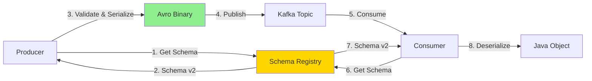
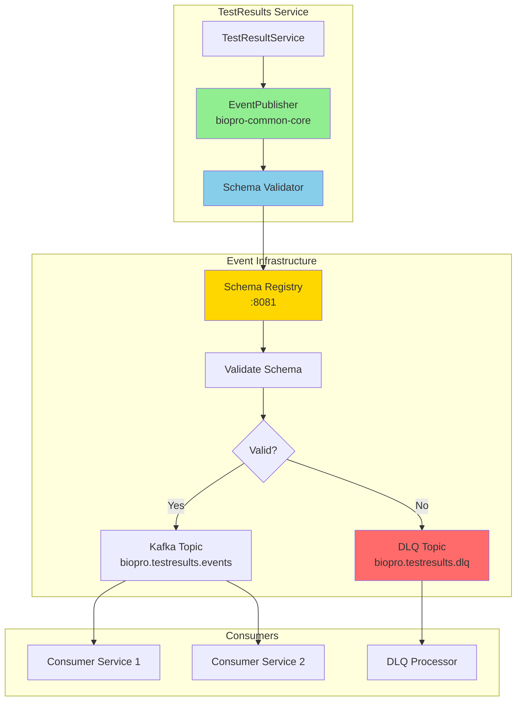
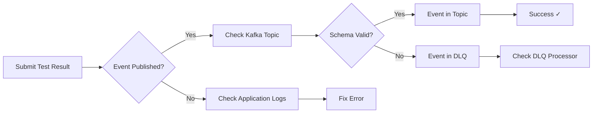
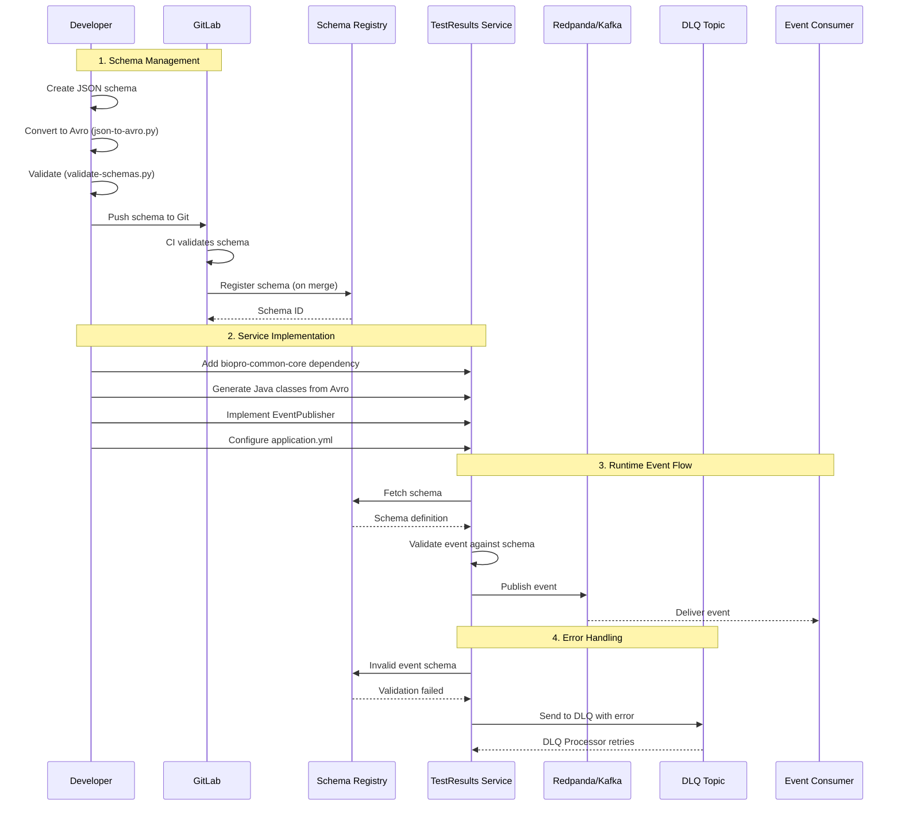

# TestResult Service Integration Guide

**A complete guide to integrating a new service into the BioPro Event Governance Framework**

**Version**: 1.0
**Last Updated**: 2024-11-16
**Audience**: Java developers integrating services with the Event Governance Framework

---

## Table of Contents

1. [Why Apache Avro?](#why-apache-avro)
2. [Overview](#overview)
3. [Prerequisites](#prerequisites)
4. [Architecture Overview](#architecture-overview)
5. [Step-by-Step Integration](#step-by-step-integration)
6. [Testing and Verification](#testing-and-verification)
7. [Troubleshooting](#troubleshooting)
8. [Related Documentation](#related-documentation)

---

## Why Apache Avro?

### What is Apache Avro?

**Apache Avro** is a data serialization format developed by the Apache Software Foundation. It's specifically designed for big data applications and provides a compact, fast, binary data format with rich data structures.

Think of Avro as a better way to send data between services compared to plain JSON:

```
JSON (Text Format)              →    Avro (Binary Format)
{ "name": "John",                    [Binary data: 50-70% smaller]
  "age": 30,                         [Schema enforced at runtime]
  "email": "john@example.com" }      [Type-safe, faster to process]
```

### Why Not Just Use JSON?

You might wonder: "We already have JSON schemas, why convert to Avro?"

Here's the problem with using plain JSON for events in production:

| Aspect | JSON | Avro |
|--------|------|------|
| **Size** | Text-based, larger payload | Binary, 50-70% smaller |
| **Speed** | Slower parsing | 2-5x faster serialization/deserialization |
| **Schema Validation** | Runtime checks, optional | Enforced at write time |
| **Schema Evolution** | No built-in versioning | Native schema versioning support |
| **Type Safety** | Strings can break at runtime | Compile-time type checking |
| **Compatibility** | Manual checking required | Automatic compatibility checks |

**Real-World Impact:**

```
Example Event: TestResultReceived

JSON payload size:     1,245 bytes
Avro payload size:       412 bytes
Reduction:              67%

At 10,000 events/second:
- JSON: 12.4 MB/sec = 1.07 TB/day
- Avro:  4.1 MB/sec = 0.35 TB/day

Cost savings: ~$300/month in network + storage
```

### Why We Use Avro at BioPro

The Event Governance Framework uses Avro for several strategic reasons:

#### 1. **Schema Registry Integration**

Avro works seamlessly with Confluent Schema Registry, giving us:
- **Centralized schema management** - Single source of truth for all event definitions
- **Automatic validation** - Producers can't send invalid events
- **Version control** - Track schema changes over time
- **Compatibility enforcement** - Prevent breaking changes



#### 2. **Schema Evolution Without Breaking Consumers**

When you need to add a new field to an event:

**With JSON:**
```json
// Old consumer sees this and might break:
{
  "testResultId": "TR-001",
  "newField": "this might cause errors"  // ← Consumer doesn't expect this
}
```

**With Avro + Schema Registry:**
```java
// Schema v1
{
  "name": "TestResultReceived",
  "fields": [
    {"name": "testResultId", "type": "string"}
  ]
}

// Schema v2 (backward compatible)
{
  "name": "TestResultReceived",
  "fields": [
    {"name": "testResultId", "type": "string"},
    {"name": "labName", "type": ["null", "string"], "default": null}  // ← Safe to add
  ]
}
```

Schema Registry validates that v2 is compatible with v1 **before** allowing the change. Old consumers keep working!

#### 3. **Type Safety and Generated Code**

Avro generates strongly-typed Java classes from schemas:

**Without Avro (manual JSON):**
```java
// Easy to make mistakes
JSONObject event = new JSONObject();
event.put("testResultID", id);      // Typo: should be "testResultId"
event.put("timestamp", "invalid");  // Should be long, not string
// These errors only appear at runtime! ❌
```

**With Avro:**
```java
// Compile-time safety
TestResultReceived event = TestResultReceived.newBuilder()
    .setTestResultId(id)           // IDE autocomplete
    .setTimestamp(Instant.now().toEpochMilli())  // Type enforced
    .build();
// Errors caught during development! ✓
```

#### 4. **Better Performance at Scale**

BioPro processes millions of events per day. Avro's binary format means:

- **Faster serialization** - 2-5x faster than JSON parsing
- **Lower network usage** - 50-70% smaller payloads
- **Reduced Kafka storage** - Less disk space needed
- **Lower costs** - Reduced infrastructure spend

#### 5. **Industry Standard for Event-Driven Systems**

Avro is the standard for modern event streaming platforms:
- **Confluent Platform** - Native Avro support
- **Apache Kafka** - Recommended serialization format
- **LinkedIn**, **Netflix**, **Uber** - Use Avro for event streams
- **Apache Spark**, **Flink** - Native Avro integration

### The Workflow: JSON → Avro

**Why start with JSON Schema?**

JSON Schema is easier for humans to read and write. We use it for **design**, then convert to Avro for **runtime**:


**Process:**
1. **Design** - Write JSON Schema (easy to understand)
2. **Convert** - Use `json-to-avro.py` tool (automated)
3. **Register** - GitLab CI registers to Schema Registry (automated)
4. **Generate** - Maven generates Java classes (automated)
5. **Code** - Use type-safe classes in your service (easy)

### What This Means for You

As a developer integrating with the Event Governance Framework:

**✓ You get:**
- Type-safe event classes generated automatically
- Compile-time error checking
- Automatic schema validation
- Built-in versioning support
- Better performance
- Lower infrastructure costs

**✓ You don't need to:**
- Write manual JSON parsing code
- Handle schema validation yourself
- Worry about breaking consumers
- Manage schema versions manually

**✓ The framework handles:**
- Schema registration
- Compatibility checking
- Serialization/deserialization
- Error handling and DLQ routing

### Summary

We convert JSON schemas to Avro because:

1. **Avro is binary** → Smaller, faster, cheaper
2. **Schema Registry integration** → Centralized management and validation
3. **Schema evolution** → Add fields without breaking consumers
4. **Type safety** → Catch errors at compile time, not runtime
5. **Industry standard** → Battle-tested by industry leaders

The rest of this guide shows you how to use these benefits in your service.

---

## Overview

This guide shows you how to integrate a new service (TestResults) into the BioPro Event Governance Framework using a real-world event: **TestResultReceived**.

**What you will learn:**
- Add `biopro-common-core` JAR to your service
- Create and register Avro schemas using the Schema Management tools
- Implement event producers with automatic schema validation
- Configure Dead Letter Queue (DLQ) handling
- Test the complete event flow

**Example Event**: `TestResultReceived` - Published when a laboratory test result is received from an external system.

---

## Prerequisites

**Required:**
- Java 17+
- Maven 3.8+
- Access to BioPro Maven repository
- Docker Desktop (for local testing)
- Git

**Knowledge:**
- Basic Java and Spring Boot
- Understanding of Kafka and event-driven architecture
- Familiarity with Avro schemas (see [Schema-Management-Guide.md](./Schema-Management-Guide.md))

**Framework Components:**
- `biopro-common-core` JAR (v1.0.0+)
- Redpanda/Kafka cluster
- Confluent Schema Registry
- GitLab CI/CD pipeline

---

## Architecture Overview

### High-Level Architecture



### Framework Components

**1. biopro-common-core JAR**
- Provides `EventPublisher<T>` for sending events
- Automatic schema validation against Schema Registry
- Built-in DLQ handling
- Retry logic and error handling

**2. Schema Registry**
- Stores and validates Avro schemas
- Enforces schema evolution rules
- Provides schema versioning

**3. DLQ (Dead Letter Queue)**
- Captures failed events
- Stores original payload and error details
- Enables debugging and replay

---

## Step-by-Step Integration

### Step 1: Add Maven Dependency

Open your service's `pom.xml` and add the `biopro-common-core` dependency:

```xml
<project>
    <!-- ... existing configuration ... -->

    <dependencies>
        <!-- BioPro Event Governance Framework -->
        <dependency>
            <groupId>com.biopro.common</groupId>
            <artifactId>biopro-common-core</artifactId>
            <version>1.0.0</version>
        </dependency>

        <!-- Kafka and Avro (provided by common-core, but listed for clarity) -->
        <dependency>
            <groupId>org.springframework.kafka</groupId>
            <artifactId>spring-kafka</artifactId>
        </dependency>

        <dependency>
            <groupId>org.apache.avro</groupId>
            <artifactId>avro</artifactId>
            <version>1.11.3</version>
        </dependency>

        <dependency>
            <groupId>io.confluent</groupId>
            <artifactId>kafka-avro-serializer</artifactId>
            <version>7.5.1</version>
        </dependency>
    </dependencies>

    <!-- Add Confluent repository for Schema Registry dependencies -->
    <repositories>
        <repository>
            <id>confluent</id>
            <url>https://packages.confluent.io/maven/</url>
        </repository>
    </repositories>
</project>
```

**Build the project:**
```bash
mvn clean install
```

---

### Step 2: Configure Application Properties

Create or update `application.yml` with Kafka and Schema Registry configuration:

```yaml
spring:
  application:
    name: testresults-service

  kafka:
    bootstrap-servers: localhost:9092

    # Producer configuration
    producer:
      key-serializer: org.apache.kafka.common.serialization.StringSerializer
      value-serializer: io.confluent.kafka.serializers.KafkaAvroSerializer
      acks: all
      retries: 3

    # Consumer configuration (if consuming events)
    consumer:
      group-id: testresults-service-consumer
      key-deserializer: org.apache.kafka.common.serialization.StringDeserializer
      value-deserializer: io.confluent.kafka.serializers.KafkaAvroDeserializer
      auto-offset-reset: earliest

    # Schema Registry
    properties:
      schema.registry.url: http://localhost:8081
      specific.avro.reader: true

# Event Governance Configuration
event-governance:
  domain: testresults
  topics:
    events: biopro.testresults.events
    dlq: biopro.testresults.dlq
  dlq:
    enabled: true
    max-retries: 3
    retry-delay-ms: 5000
```

---

### Step 3: Create the Avro Schema

**Follow the Schema Management Guide** to create and register your schema.

**3.1: Create JSON Schema**

Create `TestResultReceived.json`:

```json
{
  "$schema": "http://json-schema.org/draft-07/schema#",
  "$id": "https://biopro.com/schemas/testresults/TestResultReceived.json",
  "title": "TestResultReceived",
  "description": "Event published when a laboratory test result is received",
  "type": "object",
  "required": [
    "eventId",
    "timestamp",
    "testResultId",
    "patientId",
    "testType",
    "resultValue"
  ],
  "properties": {
    "eventId": {
      "type": "string",
      "format": "uuid",
      "description": "Unique event identifier"
    },
    "timestamp": {
      "type": "string",
      "format": "date-time",
      "description": "When the event occurred"
    },
    "testResultId": {
      "type": "string",
      "description": "Unique test result identifier"
    },
    "patientId": {
      "type": "string",
      "description": "Patient identifier"
    },
    "testType": {
      "type": "string",
      "description": "Type of test (e.g., BLOOD_GLUCOSE, CHOLESTEROL)"
    },
    "resultValue": {
      "type": "string",
      "description": "Test result value"
    },
    "resultUnit": {
      "type": "string",
      "description": "Unit of measurement (e.g., mg/dL, mmol/L)"
    },
    "normalRange": {
      "type": "object",
      "description": "Normal range for this test",
      "properties": {
        "min": {
          "type": "number"
        },
        "max": {
          "type": "number"
        }
      }
    },
    "isAbnormal": {
      "type": "boolean",
      "description": "Whether result is outside normal range"
    },
    "labName": {
      "type": "string",
      "description": "Name of the laboratory"
    },
    "performedAt": {
      "type": "string",
      "format": "date-time",
      "description": "When the test was performed"
    }
  }
}
```

**3.2: Convert to Avro Schema**

Use the schema management tools (see [Schema-Management-Guide.md](./Schema-Management-Guide.md)):

```bash
# Navigate to schema-tools directory
cd schema-tools

# Convert JSON to Avro
python json-to-avro.py \
    TestResultReceived.json \
    ../schemas/testresults/TestResultReceived.avsc
```

**3.3: Validate Schema**

```bash
# Validate the generated Avro schema
python validate-schemas.py ../schemas/
```

**Expected output:**
```
============================================================
Avro Schema Validation
============================================================
Directory: ../schemas/

Found 1 schema file(s)

Validating: ../schemas/testresults/TestResultReceived.avsc
  ✓ Valid
    - Name: TestResultReceived
    - Namespace: com.biopro.events.testresults
    - Fields: 11

============================================================
Summary
============================================================
Valid:   1
Invalid: 0

✓ All schemas are valid!
```

**3.4: Check Schema into Git**

```bash
# Create feature branch
git checkout -b feature/add-testresult-schema

# Add schema file
git add schemas/testresults/TestResultReceived.avsc

# Commit
git commit -m "Add TestResultReceived event schema v1.0"

# Push
git push origin feature/add-testresult-schema
```

**3.5: Register Schema via CI/CD**

Create merge request → GitLab CI validates → Merge to main → Auto-registers to Schema Registry

**Or register manually for local development:**
```bash
cd schema-tools
./register-schemas.sh ../schemas http://localhost:8081
```

---

### Step 4: Generate Java Classes from Avro Schema

Use the Avro Maven plugin to generate Java classes:

**Add to `pom.xml`:**

```xml
<build>
    <plugins>
        <!-- Avro code generation -->
        <plugin>
            <groupId>org.apache.avro</groupId>
            <artifactId>avro-maven-plugin</artifactId>
            <version>1.11.3</version>
            <executions>
                <execution>
                    <phase>generate-sources</phase>
                    <goals>
                        <goal>schema</goal>
                    </goals>
                    <configuration>
                        <sourceDirectory>${project.basedir}/schemas/testresults</sourceDirectory>
                        <outputDirectory>${project.build.directory}/generated-sources/avro</outputDirectory>
                        <stringType>String</stringType>
                    </configuration>
                </execution>
            </executions>
        </plugin>
    </plugins>
</build>
```

**Generate classes:**
```bash
mvn clean generate-sources
```

This creates: `target/generated-sources/avro/com/biopro/events/testresults/TestResultReceived.java`

---

### Step 5: Implement Event Publisher

**5.1: Create Event Publisher Configuration**

```java
package com.biopro.testresults.config;

import com.biopro.common.core.event.EventPublisher;
import com.biopro.events.testresults.TestResultReceived;
import org.springframework.beans.factory.annotation.Value;
import org.springframework.context.annotation.Bean;
import org.springframework.context.annotation.Configuration;
import org.springframework.kafka.core.KafkaTemplate;

@Configuration
public class EventPublisherConfig {

    @Value("${event-governance.topics.events}")
    private String eventTopic;

    @Value("${event-governance.topics.dlq}")
    private String dlqTopic;

    @Bean
    public EventPublisher<TestResultReceived> testResultEventPublisher(
            KafkaTemplate<String, Object> kafkaTemplate) {

        return new EventPublisher<>(
            kafkaTemplate,
            eventTopic,
            dlqTopic,
            TestResultReceived.class
        );
    }
}
```

**5.2: Create Service Class**

```java
package com.biopro.testresults.service;

import com.biopro.common.core.event.EventPublisher;
import com.biopro.events.testresults.TestResultReceived;
import lombok.RequiredArgsConstructor;
import lombok.extern.slf4j.Slf4j;
import org.springframework.stereotype.Service;

import java.time.Instant;
import java.util.UUID;

@Slf4j
@Service
@RequiredArgsConstructor
public class TestResultService {

    private final EventPublisher<TestResultReceived> eventPublisher;

    /**
     * Process a test result and publish event.
     *
     * @param testResultId Test result ID
     * @param patientId Patient ID
     * @param testType Type of test
     * @param resultValue Result value
     * @param resultUnit Unit of measurement
     */
    public void processTestResult(
            String testResultId,
            String patientId,
            String testType,
            String resultValue,
            String resultUnit,
            Double normalMin,
            Double normalMax,
            String labName,
            Instant performedAt) {

        log.info("Processing test result: testResultId={}, patientId={}, testType={}",
                testResultId, patientId, testType);

        try {
            // Build the event
            TestResultReceived event = TestResultReceived.newBuilder()
                .setEventId(UUID.randomUUID().toString())
                .setTimestamp(Instant.now().toEpochMilli())
                .setTestResultId(testResultId)
                .setPatientId(patientId)
                .setTestType(testType)
                .setResultValue(resultValue)
                .setResultUnit(resultUnit)
                .setNormalRange(TestResultReceived.NormalRange.newBuilder()
                    .setMin(normalMin)
                    .setMax(normalMax)
                    .build())
                .setIsAbnormal(isAbnormal(Double.parseDouble(resultValue), normalMin, normalMax))
                .setLabName(labName)
                .setPerformedAt(performedAt.toEpochMilli())
                .build();

            // Publish event - framework handles schema validation and DLQ
            eventPublisher.publish(testResultId, event);

            log.info("Successfully published TestResultReceived event: testResultId={}",
                    testResultId);

        } catch (Exception e) {
            log.error("Failed to process test result: testResultId={}", testResultId, e);
            // Framework automatically sends to DLQ with error details
            throw e;
        }
    }

    private boolean isAbnormal(double value, double min, double max) {
        return value < min || value > max;
    }
}
```

**5.3: Create REST Controller (Optional)**

```java
package com.biopro.testresults.controller;

import com.biopro.testresults.service.TestResultService;
import lombok.RequiredArgsConstructor;
import lombok.extern.slf4j.Slf4j;
import org.springframework.http.ResponseEntity;
import org.springframework.web.bind.annotation.*;

import java.time.Instant;

@Slf4j
@RestController
@RequestMapping("/api/test-results")
@RequiredArgsConstructor
public class TestResultController {

    private final TestResultService testResultService;

    @PostMapping
    public ResponseEntity<String> submitTestResult(@RequestBody TestResultRequest request) {
        log.info("Received test result submission: {}", request.getTestResultId());

        testResultService.processTestResult(
            request.getTestResultId(),
            request.getPatientId(),
            request.getTestType(),
            request.getResultValue(),
            request.getResultUnit(),
            request.getNormalMin(),
            request.getNormalMax(),
            request.getLabName(),
            Instant.now()
        );

        return ResponseEntity.ok("Test result submitted successfully");
    }
}

// Request DTO
@Data
class TestResultRequest {
    private String testResultId;
    private String patientId;
    private String testType;
    private String resultValue;
    private String resultUnit;
    private Double normalMin;
    private Double normalMax;
    private String labName;
}
```

---

### Step 6: Configure DLQ Processor (Optional but Recommended)

The `biopro-common-core` framework includes a DLQ processor for handling failed events.

**Enable DLQ Processing:**

```java
package com.biopro.testresults.dlq;

import com.biopro.common.core.dlq.DlqMessage;
import com.biopro.common.core.dlq.processor.DlqProcessor;
import lombok.extern.slf4j.Slf4j;
import org.springframework.kafka.annotation.KafkaListener;
import org.springframework.stereotype.Component;

@Slf4j
@Component
public class TestResultDlqProcessor {

    private final DlqProcessor dlqProcessor;

    public TestResultDlqProcessor(DlqProcessor dlqProcessor) {
        this.dlqProcessor = dlqProcessor;
    }

    /**
     * Listen to DLQ topic and process failed events.
     */
    @KafkaListener(
        topics = "${event-governance.topics.dlq}",
        groupId = "testresults-dlq-processor"
    )
    public void processDlqMessage(DlqMessage message) {
        log.warn("Processing DLQ message: eventId={}, error={}",
                message.getOriginalEventId(),
                message.getErrorMessage());

        // Framework provides retry logic
        dlqProcessor.process(message, (dlqMsg) -> {
            // Custom retry logic or alerting
            log.info("Attempting to reprocess: {}", dlqMsg.getOriginalEventId());

            // Return true if reprocessing succeeded, false otherwise
            return reprocessTestResult(dlqMsg);
        });
    }

    private boolean reprocessTestResult(DlqMessage message) {
        // Implement custom reprocessing logic
        // Return true if successful, false to keep in DLQ
        return false;
    }
}
```

---

## Testing and Verification

### Local Testing Setup

**1. Start Infrastructure**

```bash
cd event-governance/poc
docker-compose up -d
```

**Verify services:**
```bash
docker-compose ps
```

Expected running services:
- `biopro-redpanda` (Kafka) - :9092
- `biopro-schema-registry` - :8081
- `biopro-redpanda-console` - :8090

**2. Verify Schema Registry**

```bash
# Check registered schemas
curl http://localhost:8081/subjects

# Check specific schema
curl http://localhost:8081/subjects/testresults.TestResultReceived-value/versions/latest
```

---

### Test Event Publishing

**Create Test Script:**

```bash
# test-testresult-event.sh
curl -X POST http://localhost:8080/api/test-results \
  -H "Content-Type: application/json" \
  -d '{
    "testResultId": "TR-2024-001",
    "patientId": "PT-12345",
    "testType": "BLOOD_GLUCOSE",
    "resultValue": "145",
    "resultUnit": "mg/dL",
    "normalMin": 70.0,
    "normalMax": 100.0,
    "labName": "BioPro Labs"
  }'
```

**Run test:**
```bash
chmod +x test-testresult-event.sh
./test-testresult-event.sh
```

---

### Verification Steps



**1. Check Application Logs**

```bash
# Look for successful publishing
tail -f testresults-service/logs/application.log | grep "Successfully published"
```

Expected output:
```
2024-11-16 10:30:15.123 INFO  - Successfully published TestResultReceived event: testResultId=TR-2024-001
```

**2. Verify Event in Kafka Topic**

```bash
# Consume from events topic
docker exec biopro-redpanda rpk topic consume biopro.testresults.events \
    --num 1 \
    --format json

# Or use Redpanda Console
# Open browser: http://localhost:8090
```

**3. Check Schema Registry**

```bash
# Verify schema is registered
curl http://localhost:8081/subjects/testresults.TestResultReceived-value/versions/latest | jq .
```

**4. Monitor DLQ (if event fails)**

```bash
# Consume from DLQ topic
docker exec biopro-redpanda rpk topic consume biopro.testresults.dlq \
    --num 10 \
    --format json
```

---

### Integration Test Example

```java
package com.biopro.testresults;

import com.biopro.events.testresults.TestResultReceived;
import com.biopro.testresults.service.TestResultService;
import org.apache.kafka.clients.consumer.ConsumerRecord;
import org.junit.jupiter.api.Test;
import org.springframework.beans.factory.annotation.Autowired;
import org.springframework.boot.test.context.SpringBootTest;
import org.springframework.kafka.annotation.KafkaListener;
import org.springframework.kafka.test.context.EmbeddedKafka;
import org.springframework.test.annotation.DirtiesContext;

import java.time.Instant;
import java.util.concurrent.CountDownLatch;
import java.util.concurrent.TimeUnit;

import static org.assertj.core.api.Assertions.assertThat;

@SpringBootTest
@DirtiesContext
@EmbeddedKafka(
    partitions = 1,
    topics = {"biopro.testresults.events"},
    brokerProperties = {
        "listeners=PLAINTEXT://localhost:9092",
        "port=9092"
    }
)
class TestResultServiceIntegrationTest {

    @Autowired
    private TestResultService testResultService;

    private CountDownLatch latch = new CountDownLatch(1);
    private TestResultReceived receivedEvent;

    @KafkaListener(topics = "biopro.testresults.events", groupId = "test-consumer")
    public void listen(ConsumerRecord<String, TestResultReceived> record) {
        receivedEvent = record.value();
        latch.countDown();
    }

    @Test
    void shouldPublishTestResultReceivedEvent() throws InterruptedException {
        // Given
        String testResultId = "TR-TEST-001";
        String patientId = "PT-12345";

        // When
        testResultService.processTestResult(
            testResultId,
            patientId,
            "BLOOD_GLUCOSE",
            "145",
            "mg/dL",
            70.0,
            100.0,
            "BioPro Labs",
            Instant.now()
        );

        // Then
        boolean messageReceived = latch.await(10, TimeUnit.SECONDS);
        assertThat(messageReceived).isTrue();
        assertThat(receivedEvent).isNotNull();
        assertThat(receivedEvent.getTestResultId()).isEqualTo(testResultId);
        assertThat(receivedEvent.getPatientId()).isEqualTo(patientId);
        assertThat(receivedEvent.getIsAbnormal()).isTrue(); // 145 > 100
    }
}
```

---

## Troubleshooting

### Common Issues

#### 1. Schema Registration Failed

**Problem**: HTTP 409 - Schema incompatible with previous version

**Solution**:
```bash
# Check compatibility
curl -X POST \
  -H "Content-Type: application/vnd.schemaregistry.v1+json" \
  --data @schemas/testresults/TestResultReceived.avsc \
  http://localhost:8081/compatibility/subjects/testresults.TestResultReceived-value/versions/latest

# If incompatible, create new version or fix schema
# See Schema-Evolution-Guide.md for compatibility rules
```

#### 2. Events Going to DLQ

**Problem**: All events end up in DLQ

**Check:**
1. **Schema Registry connection**
   ```bash
   curl http://localhost:8081/subjects
   ```

2. **Application logs for serialization errors**
   ```bash
   grep "SerializationException" testresults-service/logs/application.log
   ```

3. **Schema matches code**
   - Regenerate Java classes from updated schema
   - Rebuild application

#### 3. Kafka Connection Refused

**Problem**: `Connection to node -1 could not be established`

**Solution**:
```bash
# Check Kafka is running
docker-compose ps biopro-redpanda

# Check bootstrap servers in application.yml
spring.kafka.bootstrap-servers: localhost:9092

# Restart Kafka
docker-compose restart biopro-redpanda
```

#### 4. ClassNotFoundException for Generated Avro Class

**Problem**: `java.lang.ClassNotFoundException: com.biopro.events.testresults.TestResultReceived`

**Solution**:
```bash
# Regenerate Avro classes
mvn clean generate-sources

# Verify class was generated
ls -la target/generated-sources/avro/com/biopro/events/testresults/

# Rebuild
mvn clean install
```

#### 5. DLQ Messages Not Processing

**Problem**: DLQ listener not consuming messages

**Check:**
1. **DLQ topic exists**
   ```bash
   docker exec biopro-redpanda rpk topic list | grep dlq
   ```

2. **Consumer group is active**
   ```bash
   docker exec biopro-redpanda rpk group describe testresults-dlq-processor
   ```

3. **Application logs**
   ```bash
   grep "KafkaListener" testresults-service/logs/application.log
   ```

---

## Complete Workflow Diagram



---

## Related Documentation

**Schema Management:**
- [Schema-Management-Guide.md](./Schema-Management-Guide.md) - Complete guide for creating and managing Avro schemas
- [Schema-Evolution-Guide.md](./Schema-Evolution-Guide.md) - Understanding schema compatibility and evolution

**Framework Reference:**
- `biopro-common-core` JavaDocs - API documentation for EventPublisher and DLQ components
- [Event Governance Standards](http://wiki.biopro.com/event-governance) - Company-wide event governance policies

**Tools:**
- `schema-tools/README.md` - Quick reference for schema management utilities
- `.gitlab-ci.yml.example` - CI/CD pipeline template

**Infrastructure:**
- Redpanda Console: http://localhost:8090
- Schema Registry UI: http://localhost:8000
- Schema Registry API: http://localhost:8081

---

## Next Steps

**After completing this guide:**

1. **Add More Events**
   - Follow the same pattern for additional events
   - Reference this guide for each new event type

2. **Implement Consumers**
   - Create consumer services using `@KafkaListener`
   - Use generated Avro classes for type-safe consumption

3. **Set Up Monitoring**
   - Add metrics for event publishing
   - Monitor DLQ depth
   - Set up alerts for schema validation failures

4. **Production Readiness**
   - Configure SSL/TLS for Kafka
   - Set up authentication for Schema Registry
   - Implement comprehensive error handling
   - Add distributed tracing

---

**Questions?**

**Slack**: #event-governance
**Wiki**: http://wiki.biopro.com/event-governance
**Support**: event-governance-team@biopro.com

**Version**: 1.0
**Last Updated**: 2024-11-16
