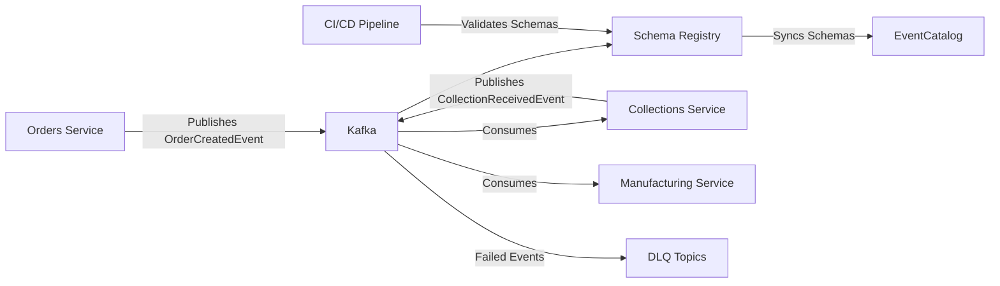

# Story: POC Documentation Package

**Story Points**: 3
**Priority**: Medium
**Epic Link**: Event Governance Framework for FDA Compliance
**Type**: Documentation
**Component**: Documentation

---

## User Story

**As a** stakeholder evaluating Event Governance POC
**I want** comprehensive documentation of architecture, setup, and usage
**So that** I can understand POC capabilities, reproduce the demo, and make informed decisions about production implementation

---

## Description

Create comprehensive documentation package for Event Governance POC covering architecture overview, setup instructions, operational procedures, and integration guides. Documentation should enable technical and non-technical stakeholders to understand POC value, reproduce demonstrations, and plan production rollout.

### Background
POC demonstrates complex event governance capabilities including:
- Schema Registry integration with Avro serialization
- Dead Letter Queue processing framework
- EventCatalog living documentation
- CI/CD schema validation pipeline
- Cross-service event flows

Stakeholders need clear documentation to understand these capabilities, evaluate business value, and assess production readiness without requiring deep technical expertise.

---

## Acceptance Criteria

**AC1: Architecture Overview Document**
- GIVEN stakeholder reviewing POC
- WHEN reading architecture documentation
- THEN document explains:
  - High-level system architecture diagram
  - Core components (Kafka, Schema Registry, EventCatalog, services)
  - Event flow patterns (producer, consumer, DLQ)
  - Integration points between components
  - Why each component is needed for event governance
- AND document uses business language, not just technical jargon

**AC2: Quick Start Guide**
- GIVEN developer setting up POC for first time
- WHEN following quick start guide
- THEN developer can:
  - Start full POC stack with single command
  - Verify all components are running
  - Access EventCatalog UI
  - Access Schema Registry UI
  - Trigger demo event flow
- AND setup completes in under 10 minutes

**AC3: Demo Script**
- GIVEN presenter demonstrating POC to stakeholders
- WHEN following demo script
- THEN script provides:
  - Step-by-step walkthrough of capabilities
  - Specific commands to run
  - Expected outputs to show
  - Business value talking points for each capability
  - Troubleshooting tips for common demo issues
- AND demo completes in 15-20 minutes

**AC4: Schema Management Guide**
- GIVEN developer working with event schemas
- WHEN consulting schema management documentation
- THEN guide explains:
  - How to register new schemas
  - How to evolve schemas (adding fields, etc.)
  - Backward compatibility rules
  - How to view schemas in EventCatalog
  - CI/CD schema validation process
- AND includes concrete examples with commands

**AC5: DLQ Operations Runbook**
- GIVEN support engineer investigating failed events
- WHEN following DLQ runbook
- THEN runbook provides:
  - How to check DLQ topics for failed events
  - How to read failure context
  - Common failure scenarios and resolutions
  - How to reprocess events from DLQ
  - When to escalate to development team
- AND includes step-by-step procedures

**AC6: Production Readiness Assessment**
- GIVEN stakeholders evaluating production rollout
- WHEN reviewing production readiness documentation
- THEN document addresses:
  - What works in POC vs. what's needed for production
  - Infrastructure requirements (hardware, networking)
  - Security considerations
  - High availability and disaster recovery needs
  - Operational monitoring requirements
  - Migration strategy from POC to production
- AND provides honest assessment of gaps

---

## Technical Details

### Documentation Structure
```
docs/
├── README.md                          # Main entry point
├── ARCHITECTURE.md                    # System architecture overview
├── QUICK-START.md                     # Setup and first run
├── DEMO-SCRIPT.md                     # Stakeholder demonstration guide
├── guides/
│   ├── SCHEMA-MANAGEMENT.md          # Working with schemas
│   ├── DLQ-OPERATIONS.md             # Dead letter queue procedures
│   ├── EVENTCATALOG-USAGE.md         # Using EventCatalog
│   └── CI-CD-INTEGRATION.md          # Pipeline integration
├── operations/
│   ├── MONITORING.md                  # Observability setup
│   ├── TROUBLESHOOTING.md            # Common issues and fixes
│   └── BACKUP-RECOVERY.md            # Data backup procedures
└── production/
    ├── READINESS-ASSESSMENT.md       # Production planning
    ├── INFRASTRUCTURE.md              # Hardware/network requirements
    └── SECURITY.md                    # Security considerations
```

### Documentation Standards
- Use Markdown for all documents
- Include diagrams using Mermaid or PlantUML
- Provide code examples for all procedures
- Use screenshots for UI walkthroughs
- Keep language clear and jargon-free for stakeholder docs

### Example Architecture Diagram (Mermaid)


---

## Implementation Tasks

### 1. Architecture Documentation (3 hours)
- [ ] Create system architecture diagram
- [ ] Document component responsibilities
- [ ] Explain event flow patterns
- [ ] Document technology choices and rationale
- [ ] Add glossary of key terms

### 2. Quick Start Guide (2 hours)
- [ ] Write step-by-step setup instructions
- [ ] Document prerequisites
- [ ] Provide docker-compose commands
- [ ] Add health check verification steps
- [ ] Include first event trigger example
- [ ] Add troubleshooting for common setup issues

### 3. Demo Script (3 hours)
- [ ] Write demonstration walkthrough
- [ ] Include schema validation demo
- [ ] Include DLQ processing demo
- [ ] Include EventCatalog navigation demo
- [ ] Add business value talking points
- [ ] Provide expected timing for each section
- [ ] Add backup plan for technical difficulties

### 4. Schema Management Guide (2 hours)
- [ ] Document schema registration process
- [ ] Provide schema evolution examples
- [ ] Explain compatibility modes
- [ ] Document CI/CD validation workflow
- [ ] Add troubleshooting for schema issues

### 5. DLQ Operations Runbook (2 hours)
- [ ] Write procedures for DLQ investigation
- [ ] Document common failure scenarios
- [ ] Provide reprocessing procedures
- [ ] Add alerting guidelines
- [ ] Include escalation procedures

### 6. Production Readiness Documentation (3 hours)
- [ ] Document POC vs. production gaps
- [ ] List infrastructure requirements
- [ ] Address security considerations
- [ ] Outline high availability architecture
- [ ] Provide migration roadmap
- [ ] Estimate production implementation effort

---

## Documentation Content Requirements

### Architecture Document Must Include:
- Component diagram with all services
- Event flow sequence diagrams
- Network topology
- Data flow (where schemas are stored, where events flow)
- Integration points

### Quick Start Must Include:
- Prerequisites (Docker, ports, etc.)
- Installation commands
- Verification steps
- First demo event trigger
- Links to next steps

### Demo Script Must Include:
- Opening talking points (business value)
- Schema Registry demo (show schema, version)
- EventCatalog demo (browse events, view services)
- DLQ demo (trigger failure, show DLQ)
- CI/CD demo (show validation, compatibility check)
- Closing talking points (production roadmap)

### DLQ Runbook Must Include:
- How to list DLQ topics
- How to read DLQ messages
- Failure context interpretation
- Reprocessing procedures
- When to escalate

---

## Definition of Done

- [ ] All documentation files created in structured folder
- [ ] Architecture diagrams included and accurate
- [ ] Quick start guide tested by someone unfamiliar with POC
- [ ] Demo script validated with successful stakeholder presentation
- [ ] Schema management guide validated against actual POC
- [ ] DLQ runbook validated with simulated failure scenarios
- [ ] Production readiness document reviewed by architecture team
- [ ] All documentation reviewed for clarity and completeness
- [ ] Documentation published to accessible location (wiki, repo)
- [ ] Table of contents created with links to all documents

---

## Documentation Review Checklist

- [ ] Technical accuracy verified by development team
- [ ] Business value statements reviewed by product owner
- [ ] Procedures tested by operations team
- [ ] Language clarity reviewed for non-technical stakeholders
- [ ] Diagrams accurately reflect POC architecture
- [ ] Commands tested and outputs verified
- [ ] Links between documents working correctly
- [ ] Formatting consistent across all documents

---

## Stakeholder Communication Plan

### Technical Audience (Developers, Architects)
- Focus: Architecture, technical implementation details
- Documents: ARCHITECTURE.md, SCHEMA-MANAGEMENT.md, CI-CD-INTEGRATION.md

### Operations Audience (Support, DevOps)
- Focus: Operational procedures, monitoring, troubleshooting
- Documents: DLQ-OPERATIONS.md, MONITORING.md, TROUBLESHOOTING.md

### Business Audience (Product, Management)
- Focus: Business value, capabilities, production readiness
- Documents: README.md (executive summary), DEMO-SCRIPT.md, READINESS-ASSESSMENT.md

---

## Risk & Mitigation

**Risk**: Documentation becomes outdated as POC evolves
- **Mitigation**: Document version with POC version
- **Mitigation**: Review documentation with each POC demo

**Risk**: Technical jargon alienates non-technical stakeholders
- **Mitigation**: Write separate sections for different audiences
- **Mitigation**: Include glossary and explain acronyms

**Risk**: Documentation doesn't reflect actual POC behavior
- **Mitigation**: Test all procedures against running POC
- **Mitigation**: Update documentation with any POC changes

---

## Future Documentation Enhancements

- Video walkthrough of demo script
- Interactive tutorial for schema management
- Troubleshooting decision tree
- Production deployment checklist
- Performance tuning guide

---

**Labels**: documentation, poc, stakeholder-communication, proof-of-concept
**Created By**: Melvin Jones
